# 🤖 AI Foundations: From Basic LLM Interactions to Agentic Systems

This repository contains a comprehensive journey through foundational AI concepts, progressing from basic LLM interactions to sophisticated agentic systems with tool integration. Each notebook and application demonstrates key patterns that form the backbone of modern AI applications.

## 📋 Table of Contents

- [🎯 Overview](#-overview)
- [🔧 Setup and Requirements](#-setup-and-requirements)
- [📚 Learning Journey](#-learning-journey)
  - [Lab 1: Basic LLM Interactions](#lab-1-basic-llm-interactions)
  - [Lab 2: Multi-Model Competition System](#lab-2-multi-model-competition-system)
  - [Lab 3: Personal Career Agent](#lab-3-personal-career-agent)
  - [Lab 4: Tool-Enabled Intelligent Agent](#lab-4-tool-enabled-intelligent-agent)
- [🚀 Production Application](#-production-application)
- [🏗️ Architecture Patterns](#️-architecture-patterns)
- [💼 Commercial Applications](#-commercial-applications)
- [📈 Key Learnings](#-key-learnings)

## 🎯 Overview

This collection demonstrates the evolution from simple prompt-response interactions to complex agentic systems capable of:
- Multi-model evaluation and comparison
- Personalized conversational agents with domain expertise
- Quality assurance through automated evaluation
- Real-world tool integration and notifications
- Production-ready web applications


## 🔧 Setup and Requirements

### Prerequisites
- Python 3.8+
- OpenAI API Key
- Optional: DeepSeek API Key, Groq API Key
- Optional: Pushover account for notifications

### Installation
```bash
pip install -r requirements.txt
```

### Environment Variables
Create a `.env` file with:
```env
OPENAI_API_KEY=your_openai_api_key
DEEPSEEK_API_KEY=your_deepseek_api_key  # Optional
GROQ_API_KEY=your_groq_api_key          # Optional
PUSHOVER_USER=your_pushover_user        # Optional
PUSHOVER_TOKEN=your_pushover_token      # Optional
```

## 📚 Learning Journey

### Lab 1: Basic LLM Interactions
**File:** [`1_lab.ipynb`](1_lab.ipynb)

This foundational lab introduces core concepts of LLM interaction:

#### What We Built:
- Environment setup and API key validation
- Basic prompt-response patterns
- Business opportunity identification workflow

#### Key Concepts:


#### Code Highlights:
- **API Setup**: Secure environment variable management
- **Interactive Q&A**: Dynamic question generation and answering
- **Business Focus**: AI-driven business opportunity exploration

---

### Lab 2: Multi-Model Competition System  
**File:** [`2_lab.ipynb`](2_lab.ipynb)

An advanced system for evaluating multiple LLMs against each other:

#### System Architecture:


#### Features:
- **Multi-Provider Support**: OpenAI, Groq, DeepSeek integration
- **Automated Judging**: O3-mini as an impartial evaluator
- **JSON Response Parsing**: Structured result handling
- **Scalable Framework**: Easy addition of new models

#### Commercial Applications:
- Model selection for specific use cases
- Quality assurance in production systems
- Benchmark testing for custom models

---

### Lab 3: Personal Career Agent
**File:** [`3_lab.ipynb`](3_lab.ipynb)

A sophisticated personal AI agent with domain expertise and quality control:

#### Agent Architecture:

```mermaid
graph TB
    subgraph "Data Sources"
        A[LinkedIn PDF]
        B[Summary Text]
    end
    
    subgraph "AI Agent System"
        C[System Prompt]
        D[Chat Interface]
        E[Response Generator]
        F[Quality Evaluator]
        G[Response Regenerator]
    end
    
    subgraph "User Interface"  
        H[Gradio Web App]
        I[Chat History]
    end
    
    A --> C
    B --> C
    C --> E
    E --> F
    F -->|Acceptable| H
    F -->|Rejected| G
    G --> H
    H --> I
    
    style C fill:#e3f2fd
    style F fill:#ffcdd2
    style H fill:#e8f5e8
```


#### Key Innovations:
- **Domain Expertise**: PDF parsing for professional context
- **Quality Assurance**: Automated response evaluation
- **Self-Correction**: Retry mechanism with feedback
- **Professional Tone**: Tailored for career/business contexts

#### Implementation Details:
- **Data Ingestion**: PyPDF for LinkedIn profile extraction
- **Evaluation System**: Pydantic models for structured feedback
- **Retry Logic**: Intelligent response regeneration
- **Web Interface**: Gradio for user-friendly interaction

---

### Lab 4: Tool-Enabled Intelligent Agent
**File:** [`4_lab.ipynb`](4_lab.ipynb)

A production-ready agent with real-world tool integration:

#### Tool Integration Flow:


#### Advanced Features:
- **Function Calling**: OpenAI tools integration
- **Real-time Notifications**: Pushover API integration
- **Dynamic Tool Discovery**: `globals()` for scalable tool management
- **Conversation Flow Control**: While loops for multi-step interactions
- **Lead Generation**: Automated contact information capture

#### Tool Definitions:
1. **`record_user_details`**: Captures user contact information
2. **`record_unknown_question`**: Logs unanswered queries for improvement

---

## 🚀 Production Application
**File:** [`app.py`](app.py)

A clean, production-ready implementation combining all learned concepts:

### Architecture Highlights:


### Production Features:
- **Object-Oriented Design**: Clean `Me` class encapsulation
- **Error Handling**: Robust tool call management
- **Scalability**: Easy extension with new tools
- **Deployment Ready**: Gradio web interface

## 🏗️ Architecture Patterns

### 1. Progressive Complexity Pattern


### 2. Evaluation-Driven Development


### 3. Tool-Augmented Intelligence


## 💼 Commercial Applications

### 1. Customer Service Automation
- Multi-model evaluation ensures best responses
- Tool integration enables CRM updates
- Quality control maintains brand standards

### 2. Sales Lead Generation  
- Automated contact information capture
- Real-time notification systems
- Conversation analysis and insights

### 3. Professional Services
- Domain expertise through document integration
- Quality assurance for client-facing communications
- Scalable consultation services

### 4. Content Quality Assurance
- Automated evaluation systems
- Multi-provider model comparison
- Continuous improvement through feedback loops

## 📈 Key Learnings

### Technical Insights:
1. **Progressive Enhancement**: Start simple, add complexity incrementally
2. **Quality First**: Always implement evaluation mechanisms
3. **Tool Integration**: Function calling unlocks real-world applications
4. **Multi-Model Strategy**: Different models excel at different tasks

### Business Insights:
1. **User Experience**: Gradio enables rapid prototyping and deployment
2. **Monitoring**: Real-time notifications are crucial for business applications
3. **Personalization**: Domain-specific knowledge dramatically improves responses
4. **Scalability**: Object-oriented design facilitates growth and maintenance

### Best Practices:
- Always validate API connections before proceeding
- Implement quality control from the beginning
- Use structured outputs (Pydantic) for reliability
- Design for extensibility with tool systems
- Maintain conversation context effectively

---

## 🔗 Navigation Links

- [🏠 Back to Main Repository](../README.md)
- [📂 View Source Code](.)
- [🚀 Run Production App](app.py)
- [📊 Explore Notebooks](.)

---

*This foundational module provides the building blocks for all advanced agentic AI systems explored in subsequent modules.*
