# 🚀 OpenAI Agents Framework: Advanced Multi-Agent Systems

This repository demonstrates the power of OpenAI's Agents Framework for building sophisticated multi-agent systems with tool integration, handoffs, guardrails, and web search capabilities. The collection progresses from basic agent creation to production-ready deep research systems.

## 📋 Table of Contents

- [🎯 Overview](#-overview)
- [🔧 Setup and Requirements](#-setup-and-requirements)
- [📚 Learning Journey](#-learning-journey)
  - [Lab 1: Basic Agent Creation](#lab-1-basic-agent-creation)
  - [Lab 2: Multi-Agent Sales System](#lab-2-multi-agent-sales-system)
  - [Lab 3: Cross-Platform Integration & Guardrails](#lab-3-cross-platform-integration--guardrails)
  - [Lab 4: Deep Research System](#lab-4-deep-research-system)
- [🏭 Production Application](#-production-application)
- [🏗️ Architecture Patterns](#️-architecture-patterns)
- [💼 Commercial Applications](#-commercial-applications)
- [📈 Key Learnings](#-key-learnings)

## 🎯 Overview

This collection showcases the evolution from simple agent interactions to complex multi-agent orchestrations capable of:
- Autonomous agent collaboration through tools and handoffs
- Cross-platform model integration (OpenAI, Groq, DeepSeek)
- Input/output guardrails for safety and compliance
- Web search and deep research capabilities
- Production-ready applications with streaming interfaces

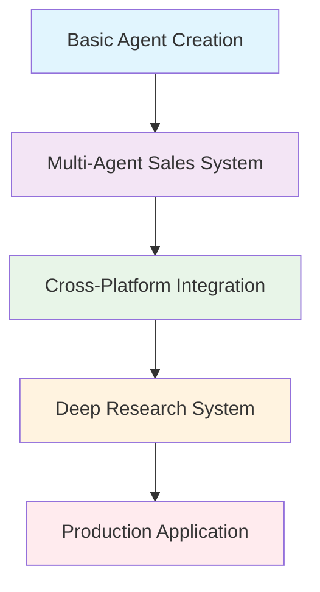

## 🔧 Setup and Requirements

### Prerequisites
- Python 3.8+
- OpenAI API Key (with Agents enabled)
- Optional: Groq API Key, DeepSeek API Key
- SendGrid API Key for email functionality

### Installation
```bash
pip install -r requirements.txt
```

### Environment Variables
Create a `.env` file with:
```env
OPENAI_API_KEY=your_openai_api_key
GROQ_API_KEY=your_groq_api_key          # Optional
DEEPSEEK_API_KEY=your_deepseek_api_key  # Optional
SENDGRID_API_KEY=your_sendgrid_api_key  # For email functionality
```

## 📚 Learning Journey

### Lab 1: Basic Agent Creation
**File:** [`1_lab.ipynb`](1_lab.ipynb)

Introduction to OpenAI Agents Framework fundamentals:

#### System Architecture:
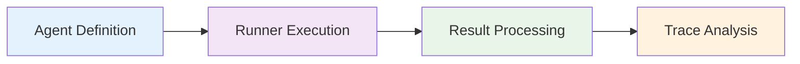

#### Key Features Demonstrated:
- **Agent Creation**: Simple agent with name, instructions, and model
- **Execution Patterns**: Using `Runner.run()` for agent execution
- **Tracing**: Built-in tracing for debugging and monitoring
- **OpenAI Platform Integration**: Direct trace viewing on OpenAI platform

#### Code Highlights:
```python
# Basic agent creation
agent = Agent(
    name="Jokester", 
    instructions="You are a professional joke teller", 
    model='gpt-4.1-nano'
)

# Execution with tracing
with trace("telling a joke"):
    result = await Runner.run(agent, "tell me the best joke")
```

---

### Lab 2: Multi-Agent Sales System
**File:** [`2_lab.ipynb`](2_lab.ipynb)

A comprehensive sales automation system demonstrating agent collaboration:

#### Multi-Agent Architecture:
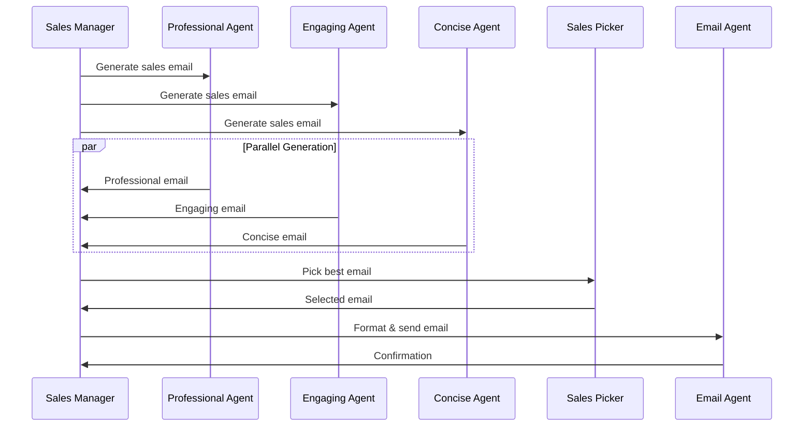

#### Advanced Features:
1. **Agent Workflows**: Parallel execution of multiple sales agents
2. **Tools Integration**: Converting agents to tools for reusability
3. **Handoffs**: Seamless control transfer between agents
4. **Email Integration**: SendGrid API for actual email delivery

#### Key Innovations:
- **Agent-as-Tools**: Converting agents to reusable function tools
- **Selection Logic**: Automated best email selection
- **HTML Email Processing**: Subject writing and HTML conversion
- **Control Flow**: Manager agent orchestrating the entire process

#### Tool Integration Pattern:
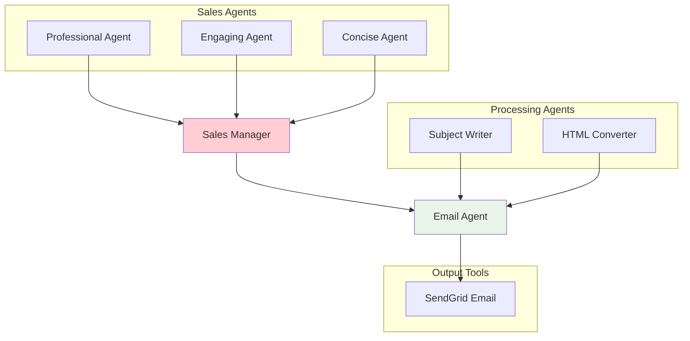

---

### Lab 3: Cross-Platform Integration & Guardrails
**File:** [`3_lab.ipynb`](3_lab.ipynb)

Advanced system with multi-provider support and safety mechanisms:

#### Cross-Platform Architecture:
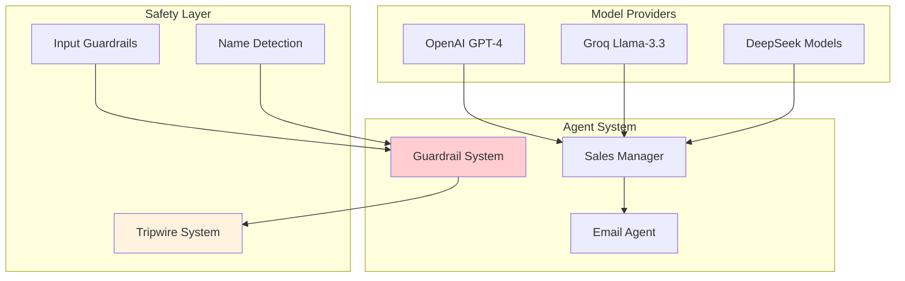

#### Guardrails System:
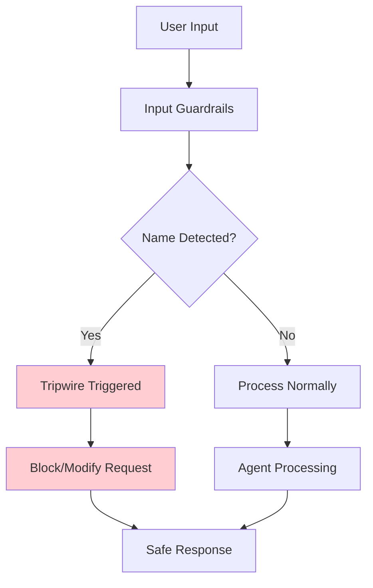

#### Key Features:
- **Multi-Provider Support**: OpenAI, Groq, and DeepSeek integration
- **Input Guardrails**: Pydantic-based safety checks
- **Tripwire System**: Automated blocking of problematic inputs
- **Cross-Model Collaboration**: Different models for different tasks

---

### Lab 4: Deep Research System
**File:** [`4_lab.ipynb`](4_lab.ipynb)

Production-ready research system with web search and structured outputs:

#### Research Pipeline Architecture:
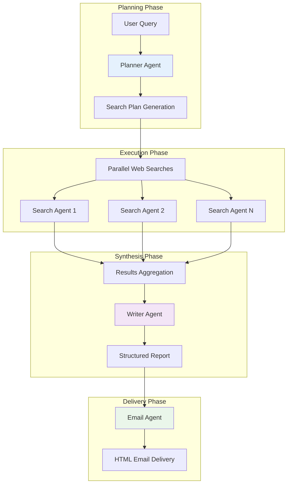

#### Advanced Components:

##### 1. **Structured Planning System**
```python
class WebSearchPlan(BaseModel):
    searches: list[WebSearchItem]
    
class WebSearchItem(BaseModel):
    reason: str  # Why this search matters
    query: str   # What to search for
```

##### 2. **Parallel Execution Engine**
```python
async def perform_searches(search_plan):
    tasks = [asyncio.create_task(search(item)) for item in search_plan.searches]
    results = await asyncio.gather(*tasks)
    return results
```

##### 3. **Comprehensive Output Structure**
```python
class ReportData(BaseModel):
    short_summary: str
    markdown_report: str
    follow_up_questions: list[str]
```

#### Web Search Integration:
- **OpenAI WebSearchTool**: Hosted web search capability
- **Cost-Aware Implementation**: Configurable search context size
- **Error Handling**: Graceful degradation for failed searches
- **Parallel Processing**: Concurrent search execution

---

## 🏭 Production Application
**Folder:** [`deep_research/`](deep_research/)

A complete production-ready research application with streaming interface:

### Application Architecture:
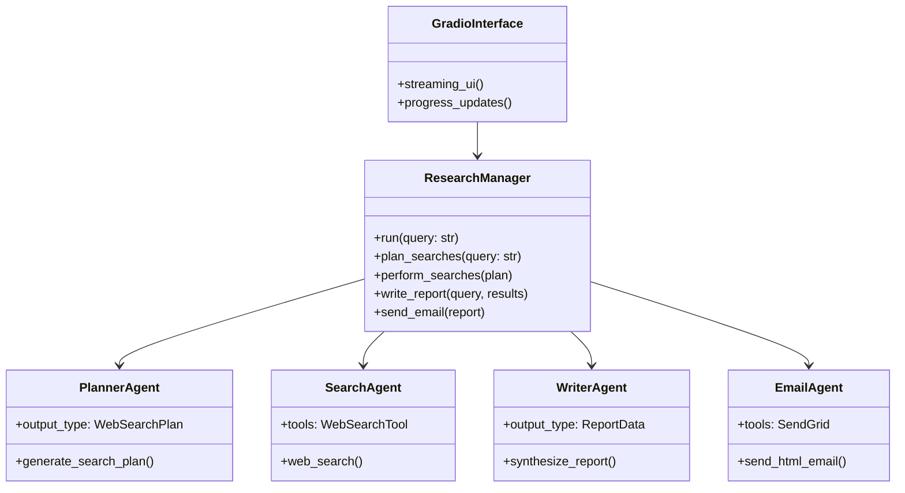

### Production Features:
- **Streaming Interface**: Real-time progress updates
- **Modular Design**: Separate agent files for maintainability
- **Error Recovery**: Graceful handling of failed searches
- **Trace Integration**: Built-in monitoring and debugging
- **Web Deployment**: Gradio-based web interface

### Key Files:
- `deep_research.py`: Main application with Gradio UI
- `research_manager.py`: Core orchestration logic
- `planner_agent.py`: Search planning intelligence
- `search_agent.py`: Web search execution
- `writer_agent.py`: Report synthesis
- `email_agent.py`: Email delivery

---

## 🏗️ Architecture Patterns

### 1. Agent Orchestration Pattern
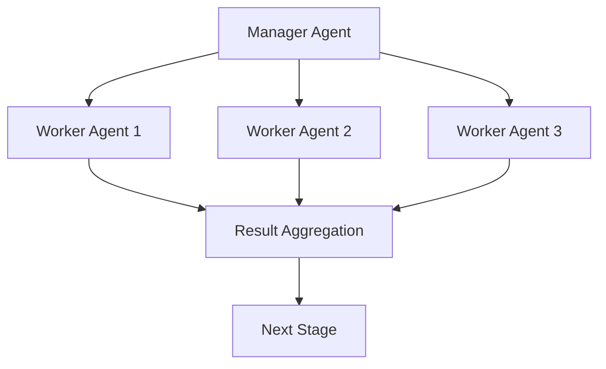

### 2. Tool Integration Pattern
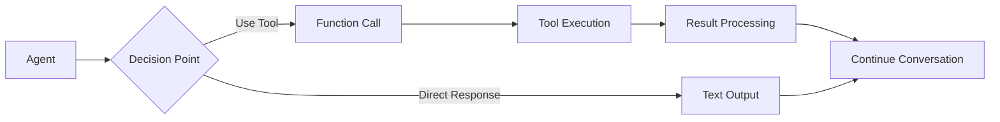

### 3. Handoff Pattern
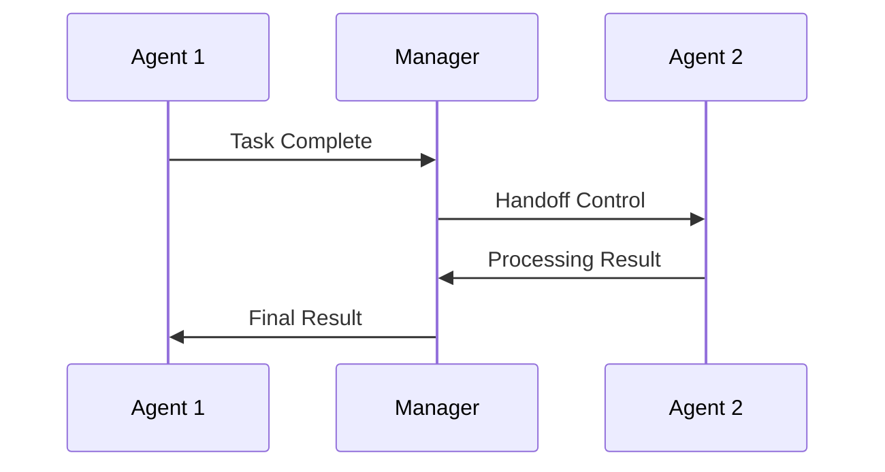

### 4. Guardrail Pattern
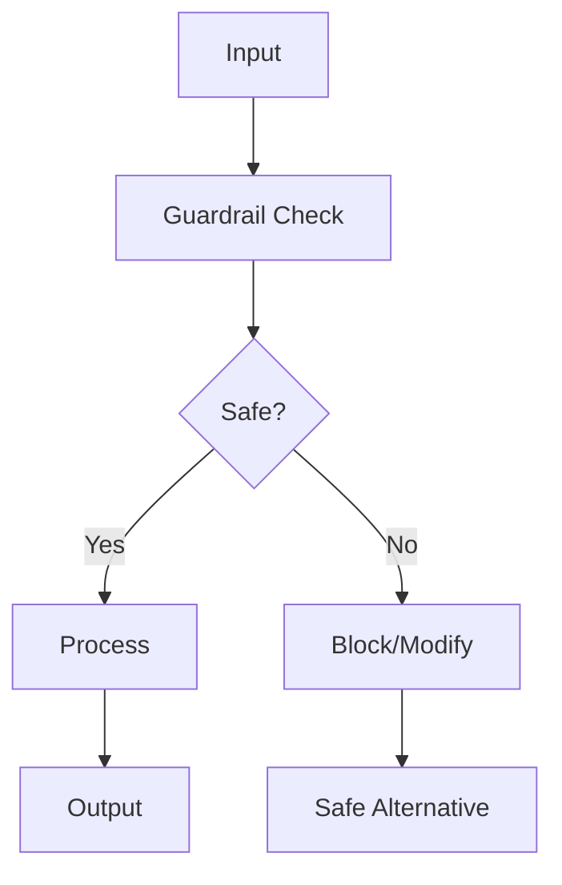

## 💼 Commercial Applications

### 1. **Automated Sales Development**
- Multi-style email generation
- A/B testing through parallel agents
- Automated lead qualification
- CRM integration capabilities

### 2. **Market Research Automation**
- Comprehensive topic analysis
- Real-time web data integration
- Structured report generation
- Stakeholder communication

### 3. **Content Creation Pipeline**
- Research-driven content
- Multi-format output generation
- Quality assurance through multiple agents
- Distribution automation

### 4. **Customer Support Intelligence**
- Query categorization
- Response quality validation
- Escalation management
- Knowledge base updates

### 5. **Compliance and Safety Systems**
- Input validation and filtering
- Policy enforcement
- Audit trail maintenance
- Risk mitigation

## 📈 Key Learnings

### Technical Insights:

#### 1. **Agent Design Principles**
- **Single Responsibility**: Each agent should have a focused purpose
- **Clear Instructions**: Precise instructions lead to better outcomes
- **Model Selection**: Match model capabilities to task requirements

#### 2. **Collaboration Patterns**
- **Tools vs Handoffs**: Tools return control, handoffs transfer it
- **Async Execution**: Parallel processing dramatically improves performance
- **State Management**: Careful context passing between agents

#### 3. **Production Considerations**
- **Error Handling**: Graceful degradation for failed operations
- **Cost Management**: Monitor API usage, especially for web search
- **Observability**: Built-in tracing is essential for debugging

### Business Insights:

#### 1. **Quality Through Diversity**
- Multiple agents provide different perspectives
- Selection mechanisms improve final output quality
- A/B testing becomes built-in capability

#### 2. **Scalability Through Modularity**
- Agent-as-tools pattern enables reuse
- Clear separation of concerns
- Easy addition of new capabilities

#### 3. **Safety First**
- Guardrails are essential for production systems
- Input validation prevents problematic outputs
- Compliance requirements can be automated

### Best Practices:

#### 1. **Development Workflow**
- Start simple with basic agents
- Add complexity incrementally
- Use tracing extensively for debugging
- Test error conditions early

#### 2. **Production Deployment**
- Implement comprehensive monitoring
- Plan for API rate limits and costs
- Design for graceful degradation
- Maintain audit trails

#### 3. **Agent Design**
- Use structured outputs (Pydantic) for reliability
- Implement proper tool descriptions
- Consider context length limitations
- Plan for multi-model scenarios

---

## 🔗 Navigation Links

- [🏠 Back to Main Repository](../README.md)
- [📂 View Source Code](.)
- [🚀 Run Deep Research App](deep_research/deep_research.py)
- [📊 Explore Notebooks](.)
- [🔍 OpenAI Traces](https://platform.openai.com/traces)

---

## 🎯 Next Steps

After mastering these concepts, you're ready to:
- Build custom multi-agent systems for your domain
- Integrate with enterprise systems and APIs
- Implement sophisticated workflow automation
- Create production-ready AI applications

*This module demonstrates the power of orchestrated AI agents working together to solve complex, real-world problems.*
