# 🤖 CrewAI Multi-Agent Systems: Production-Ready Agent Orchestration

This repository showcases the power of CrewAI framework for building sophisticated multi-agent systems across diverse domains. Each project demonstrates different aspects of agent collaboration, from simple coding tasks to complex financial analysis and engineering workflows.

## 📋 Table of Contents

- [🎯 Overview](#-overview)
- [🔧 Setup and Requirements](#-setup-and-requirements)
- [🏗️ Project Architecture](#️-project-architecture)
- [📚 Project Portfolios](#-project-portfolios)
  - [Coder: Autonomous Programming Agent](#coder-autonomous-programming-agent)
  - [Debate: Multi-Perspective Analysis System](#debate-multi-perspective-analysis-system)
  - [Engineering Team: Full-Stack Development Crew](#engineering-team-full-stack-development-crew)
  - [Financial Researcher: Investment Analysis Platform](#financial-researcher-investment-analysis-platform)
  - [Stock Picker: Intelligent Investment Advisor](#stock-picker-intelligent-investment-advisor)
- [🏗️ CrewAI Patterns](#️-crewai-patterns)
- [💼 Commercial Applications](#-commercial-applications)
- [📈 Key Learnings](#-key-learnings)

## 🎯 Overview

This collection demonstrates the versatility of CrewAI for building production-ready multi-agent systems across various domains:

- **Autonomous Code Generation** with execution and validation
- **Multi-perspective Analysis** through structured debates
- **Complete Software Development** lifecycles with specialized roles
- **Financial Research and Analysis** with real-time data integration
- **Investment Decision Making** with memory and learning capabilities

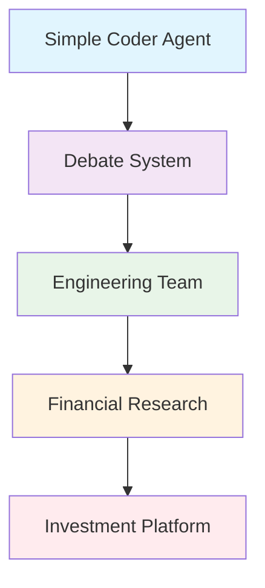

## 🔧 Setup and Requirements

### Prerequisites
- Python ≥3.10 <3.14
- UV package manager
- OpenAI API Key
- Optional: Groq API Key, Pushover credentials, SerperDev API

### Universal Installation
Each project uses the same setup pattern:

```bash
# Install UV if not already installed
pip install uv

# Navigate to any project directory
cd [project_name]

# Install dependencies
crewai install

# Add API keys to .env file
echo "OPENAI_API_KEY=your_key_here" > .env
```

### Environment Variables Template
```env
OPENAI_API_KEY=your_openai_api_key
GROQ_API_KEY=your_groq_api_key          # For multi-model support
PUSHOVER_USER=your_pushover_user        # For notifications
PUSHOVER_TOKEN=your_pushover_token      # For notifications
SERPER_API_KEY=your_serper_api_key      # For web search
```

## 🏗️ Project Architecture

Each CrewAI project follows a consistent structure:

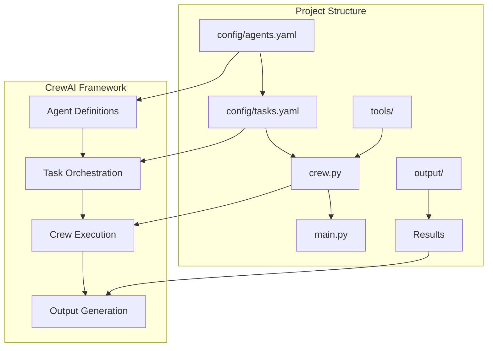

## 📚 Project Portfolios

### Coder: Autonomous Programming Agent
**Directory:** [`coder/`](coder/)

A self-contained programming agent that can understand requirements, write code, execute it, and validate results.

#### System Architecture:
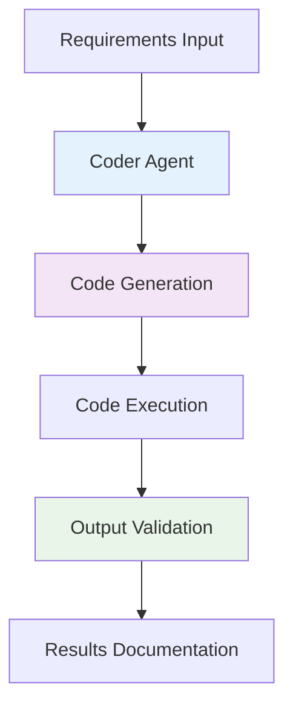

#### Agent Configuration:
```yaml
coder:
  role: Python Developer
  goal: Write, execute, and validate Python code
  model: openai/gpt-4o-mini
```

#### Key Features:
- **Autonomous Coding**: Complete code lifecycle from requirements to execution
- **Self-Validation**: Executes and tests generated code
- **Documentation**: Produces comprehensive output documentation
- **Mathematical Computing**: Specialized in complex calculations (e.g., π approximation)

#### Sample Assignment:
*"Calculate the first 10,000 terms of the Leibniz formula for π: 1 - 1/3 + 1/5 - 1/7 + ..."*

---

### Debate: Multi-Perspective Analysis System
**Directory:** [`debate/`](debate/)

A sophisticated debate system with multiple agents providing different perspectives on complex topics.

#### Debate Architecture:
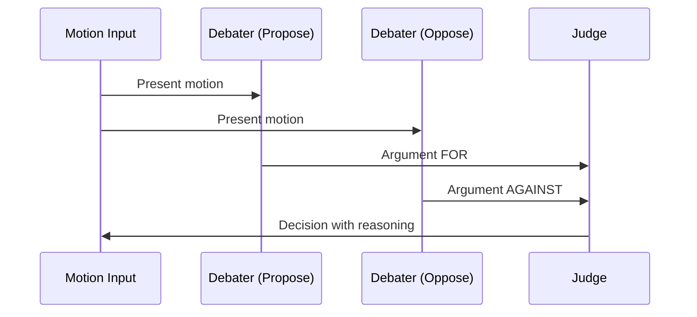

#### Multi-Model Integration:
- **Debaters**: `openai/gpt-4.1-nano` for consistent argumentation
- **Judge**: `groq/llama-3.1-70b-versatile` for impartial evaluation

#### Agent Roles:
```yaml
debater:
  role: Compelling debater
  goal: Present clear arguments for/against motion
  
judge:
  role: Fair decision maker
  goal: Evaluate arguments objectively
```

#### Process Flow:
1. **Proposal Phase**: Generate compelling arguments FOR the motion
2. **Opposition Phase**: Generate compelling arguments AGAINST the motion  
3. **Judgment Phase**: Impartial evaluation and decision
4. **Documentation**: Save all arguments and final decision

---

### Engineering Team: Full-Stack Development Crew
**Directory:** [`engineering_team/`](engineering_team/)

A complete software development team simulation with specialized roles for end-to-end application development.

#### Team Structure:
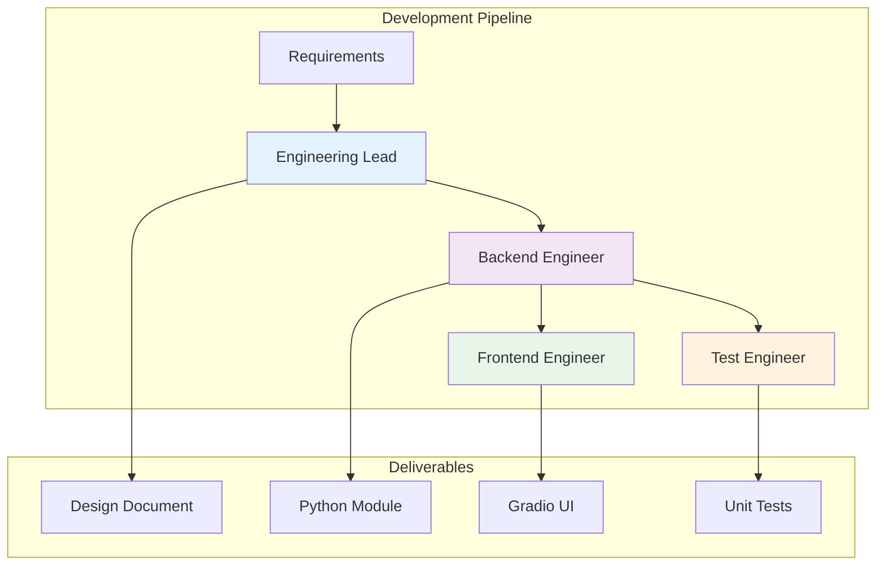

#### Specialized Roles:

##### 1. **Engineering Lead**
- **Model**: `openai/gpt-4o`
- **Responsibility**: Architecture design and technical specifications
- **Output**: Detailed design documents with class/method signatures

##### 2. **Backend Engineer**
- **Model**: `openai/gpt-4o`  
- **Responsibility**: Python module implementation
- **Output**: Self-contained, production-ready Python modules

##### 3. **Frontend Engineer**
- **Model**: `openai/gpt-4o`
- **Responsibility**: Gradio UI development
- **Output**: Interactive web interfaces for backend modules

##### 4. **Test Engineer**
- **Model**: `openai/gpt-4o`
- **Responsibility**: Comprehensive unit testing
- **Output**: Complete test suites with edge case coverage

#### Development Workflow:
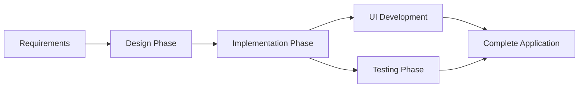

#### Task Dependencies:
- Backend implementation depends on design completion
- Frontend development requires backend completion
- Testing runs in parallel with frontend development

---

### Financial Researcher: Investment Analysis Platform
**Directory:** [`financial_researcher/`](financial_researcher/)

A dual-agent system for comprehensive company research and financial analysis.

#### Research Pipeline:
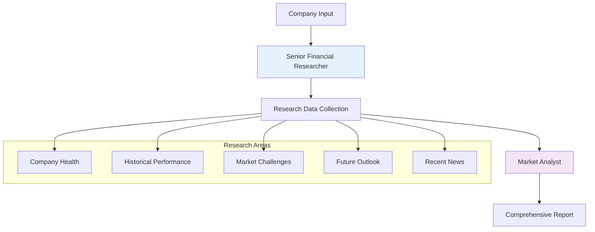

#### Agent Specialization:

##### **Senior Financial Researcher**
- **Model**: `openai/gpt-4.1-nano`
- **Focus**: Data collection and fact-finding
- **Deliverables**: Structured research documents

##### **Market Analyst**  
- **Model**: `openai/gpt-4o-mini`
- **Focus**: Analysis, insights, and report writing
- **Deliverables**: Professional investment reports

#### Research Methodology:
1. **Current Status Analysis**: Financial health and market position
2. **Historical Review**: Performance trends and patterns
3. **Challenge Assessment**: Risk factors and obstacles
4. **Opportunity Identification**: Growth potential and catalysts
5. **Future Outlook**: Projections and strategic direction

---

### Stock Picker: Intelligent Investment Advisor
**Directory:** [`stock_picker/`](stock_picker/)

The most sophisticated project featuring hierarchical management, memory systems, and real-time notifications.

#### System Architecture:
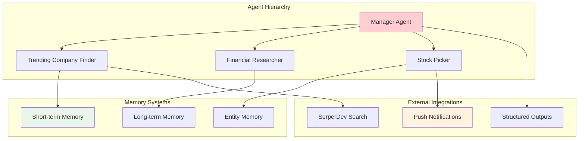

#### Advanced Features:

##### **Hierarchical Management**
```python
process=Process.hierarchical
manager_agent=manager
allow_delegation=True
```

##### **Memory Integration**
- **Short-term**: RAG-based storage for recent context
- **Long-term**: SQLite storage for persistent learning
- **Entity**: Relationship mapping for companies and markets

##### **Structured Data Models**
```python
class TrendingCompany(BaseModel):
    name: str = Field(description="Company name")
    ticker: str = Field(description="Stock ticker symbol")
    reason: str = Field(description="Trending reason")

class TrendingCompanyResearch(BaseModel):
    market_position: str
    future_outlook: str
    investment_potential: str
```

#### Workflow Process:
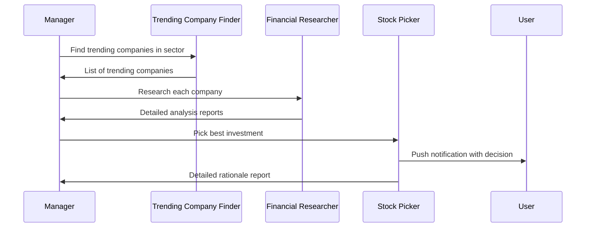

#### Intelligence Features:
- **Market Awareness**: Real-time news analysis
- **Trend Detection**: Identifies emerging opportunities
- **Comparative Analysis**: Multi-company evaluation
- **Decision Rationale**: Transparent reasoning
- **User Communication**: Instant notifications

---

## 🏗️ CrewAI Patterns

### 1. Sequential Processing Pattern
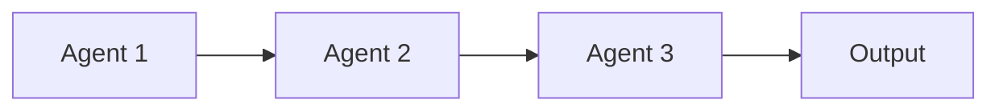

**Used in**: Engineering Team, Financial Researcher
- Clear task dependencies
- Linear workflow progression
- Context passing between agents

### 2. Parallel Processing Pattern
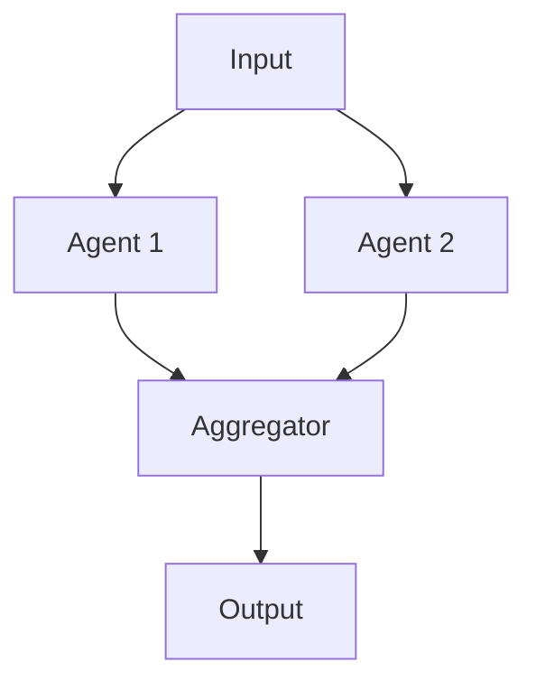

**Used in**: Debate System
- Independent perspective generation
- Comparative analysis
- Multiple viewpoint synthesis

### 3. Hierarchical Management Pattern
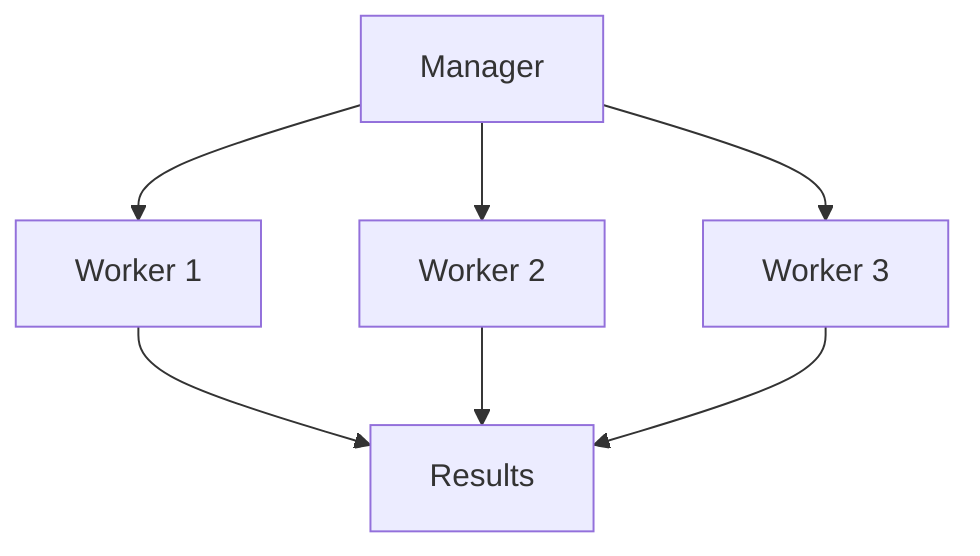

**Used in**: Stock Picker
- Task delegation and coordination
- Resource optimization
- Quality control and oversight

### 4. Memory-Enhanced Pattern
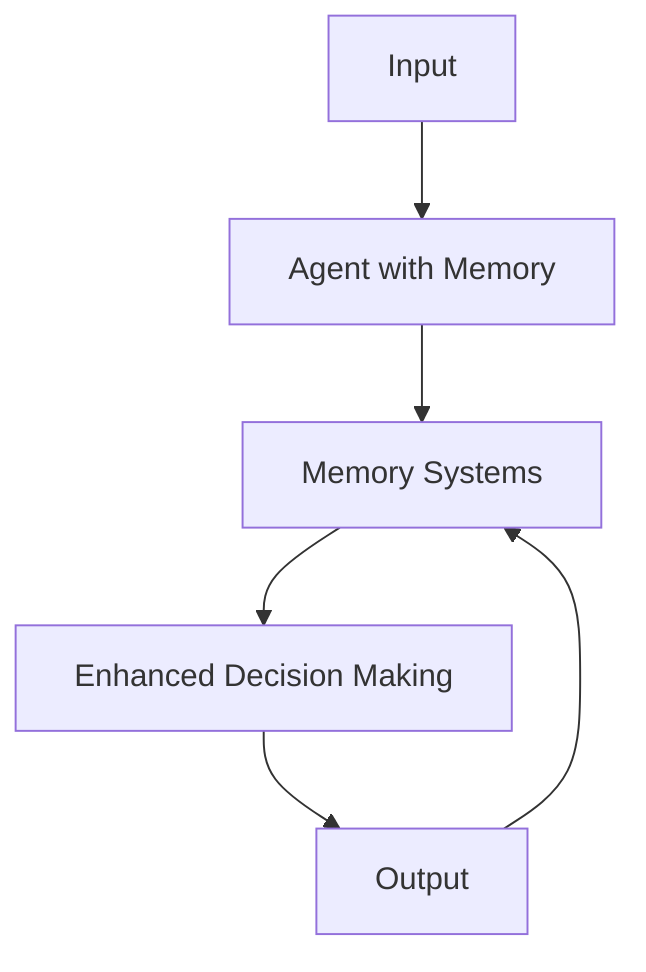

**Used in**: Stock Picker, Coder
- Learning from past decisions
- Context awareness across sessions
- Improved performance over time

## 💼 Commercial Applications

### 1. **Software Development Automation**
- **Engineering Team**: Complete application development pipelines
- **Code Generation**: Automated programming with validation
- **Quality Assurance**: Integrated testing and documentation

### 2. **Financial Services**
- **Investment Research**: Comprehensive company analysis
- **Portfolio Management**: Intelligent stock selection
- **Risk Assessment**: Multi-perspective evaluation

### 3. **Decision Support Systems**
- **Policy Analysis**: Structured debate frameworks
- **Strategic Planning**: Multi-agent consensus building
- **Risk Evaluation**: Comprehensive perspective analysis

### 4. **Research and Analysis**
- **Market Intelligence**: Real-time trend analysis
- **Competitive Analysis**: Multi-company comparisons
- **Technical Research**: Automated investigation workflows

### 5. **Content Creation**
- **Technical Documentation**: Automated report generation
- **Code Documentation**: Self-documenting development
- **Analysis Reports**: Structured research outputs

## 📈 Key Learnings

### Technical Insights:

#### 1. **Agent Design Principles**
- **Role Clarity**: Each agent should have a specific, well-defined purpose
- **Model Selection**: Match model capabilities to task complexity
- **Tool Integration**: Enhance agents with appropriate external tools
- **Memory Systems**: Implement learning for complex workflows

#### 2. **Collaboration Patterns**
- **Sequential**: For dependent tasks requiring context passing
- **Parallel**: For independent perspectives and comparative analysis
- **Hierarchical**: For complex workflows requiring coordination
- **Memory-Enhanced**: For learning and improvement over time

#### 3. **Production Considerations**
- **Error Handling**: Robust failure management across agent networks
- **Cost Optimization**: Strategic model selection for different roles
- **Scalability**: Modular design for easy expansion
- **Monitoring**: Comprehensive logging and output tracking

### Business Insights:

#### 1. **Value Creation Through Specialization**
- Different agents excel at different tasks
- Specialization leads to higher quality outputs
- Team composition matters for success

#### 2. **Decision Quality Through Diversity**
- Multiple perspectives improve decision making
- Structured disagreement reveals blind spots
- Consensus building creates robust solutions

#### 3. **Automation Potential**
- Complete workflows can be automated end-to-end
- Human oversight becomes strategic rather than tactical
- Quality remains high with proper agent design

### Best Practices:

#### 1. **Development Workflow**
- Start with simple single-agent systems
- Add complexity and collaboration incrementally
- Test each agent role independently
- Validate team performance holistically

#### 2. **Configuration Management**
- Use YAML configurations for easy modification
- Implement structured data models (Pydantic)
- Design for configuration-driven behavior
- Maintain clear documentation standards

#### 3. **Production Deployment**
- Implement comprehensive monitoring
- Plan for API rate limits and costs
- Design for graceful degradation
- Maintain audit trails for decisions

#### 4. **Quality Assurance**
- Validate outputs at each stage
- Implement feedback loops for improvement
- Test edge cases and error conditions
- Monitor agent performance over time

---

## 🔗 Navigation Links

- [🏠 Back to Main Repository](../README.md)
- [📂 Coder Project](coder/)
- [🎯 Debate System](debate/)
- [👥 Engineering Team](engineering_team/)
- [📊 Financial Researcher](financial_researcher/)
- [📈 Stock Picker](stock_picker/)
- [📖 CrewAI Documentation](https://docs.crewai.com)

---

## 🚀 Getting Started

1. **Choose a project** that matches your use case
2. **Follow the setup instructions** for that specific project
3. **Customize the agents and tasks** for your requirements
4. **Run the crew** and observe the collaborative behavior
5. **Iterate and improve** based on results

## 🎯 Next Steps

After mastering these CrewAI patterns, you're ready to:
- Build custom multi-agent systems for your domain
- Integrate with enterprise systems and workflows
- Implement sophisticated decision-making processes
- Create production-ready AI-powered applications

*This module demonstrates the power of CrewAI for orchestrating sophisticated multi-agent systems that can tackle complex, real-world challenges across diverse domains.*
