# 🕸️ LangGraph Multi-Agent Systems: Advanced Workflow Orchestration

This repository demonstrates the power of LangGraph for building sophisticated multi-agent systems with stateful workflows, memory management, and tool integration. The collection progresses from basic graph concepts to a production-ready AI assistant with autonomous task execution and quality assurance.

## 📋 Table of Contents

- [🎯 Overview](#-overview)
- [🔧 Setup and Requirements](#-setup-and-requirements)
- [📚 Learning Journey](#-learning-journey)
  - [Lab 1: LangGraph Fundamentals](#lab-1-langgraph-fundamentals)
  - [Lab 2: Tools and Memory Integration](#lab-2-tools-and-memory-integration)
  - [Lab 3: Web Automation with Playwright](#lab-3-web-automation-with-playwright)
  - [Lab 4: Multi-Agent Evaluation System](#lab-4-multi-agent-evaluation-system)
- [🚀 Production Application: The Sidekick](#-production-application-the-sidekick)
- [🏗️ LangGraph Architecture Patterns](#️-langgraph-architecture-patterns)
- [💼 Commercial Applications](#-commercial-applications)
- [📈 Key Learnings](#-key-learnings)

## 🎯 Overview

This collection showcases the evolution from simple state machines to complex multi-agent orchestrations capable of:
- Stateful conversation management with persistent memory
- Tool integration for web automation and file management
- Multi-agent evaluation and quality assurance systems
- Autonomous task execution with success criteria validation
- Production-ready applications with advanced error handling

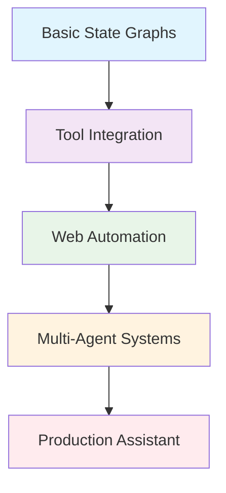

## 🔧 Setup and Requirements

### Prerequisites
- Python 3.8+
- OpenAI API Key
- Optional: LangSmith for tracing, SerperDev API, Pushover credentials
- Playwright for web automation

### Installation
```bash
# Install core dependencies
pip install langgraph langchain-openai gradio

# Install web automation tools
pip install playwright langchain-community
playwright install

# Optional: For enhanced functionality
pip install google-search-results pushover wikipedia
```

### Environment Variables
Create a `.env` file with:
```env
OPENAI_API_KEY=your_openai_api_key
LANGCHAIN_API_KEY=your_langsmith_key      # Optional for tracing
SERPER_API_KEY=your_serper_api_key        # For web search
PUSHOVER_USER=your_pushover_user          # For notifications
PUSHOVER_TOKEN=your_pushover_token        # For notifications
```

## 📚 Learning Journey

### Lab 1: LangGraph Fundamentals
**File:** [`1_lab1.ipynb`](1_lab1.ipynb)

Introduction to LangGraph's core concepts: state management, nodes, edges, and graph compilation.

#### Core Architecture:
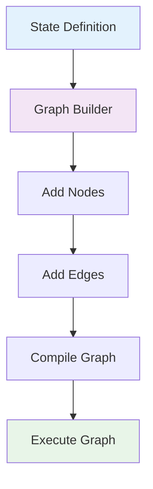

#### Key Concepts Introduced:

##### **1. State Management with Annotated Types**
```python
class State(BaseModel):
    messages: Annotated[list, add_messages]
```
- **Reducers**: Functions that manage how state updates are merged
- **add_messages**: Built-in reducer for conversation history
- **Type Safety**: Pydantic models for structured state

##### **2. Node Creation Pattern**
```python
def our_first_node(old_state: State) -> State:
    reply = f"{random.choice(nouns)} are {random.choice(adjectives)}"
    messages = [{"role": "assistant", "content": reply}]
    new_state = State(messages=messages)
    return new_state
```

##### **3. Graph Building Process**
```python
# 5-Step Pattern for all LangGraph applications:
# 1. Define State
# 2. Create Graph Builder
# 3. Add Nodes
# 4. Add Edges
# 5. Compile and Execute
```

#### Progression Demonstrated:
1. **Non-LLM Node**: Random response generation
2. **LLM Integration**: OpenAI ChatCompletion integration
3. **Gradio Interface**: Interactive web UI

---

### Lab 2: Tools and Memory Integration
**File:** [`2_lab2.ipynb`](2_lab2.ipynb)

Advanced graph with tool integration and persistent memory using checkpointing.

#### Tool Integration Architecture:
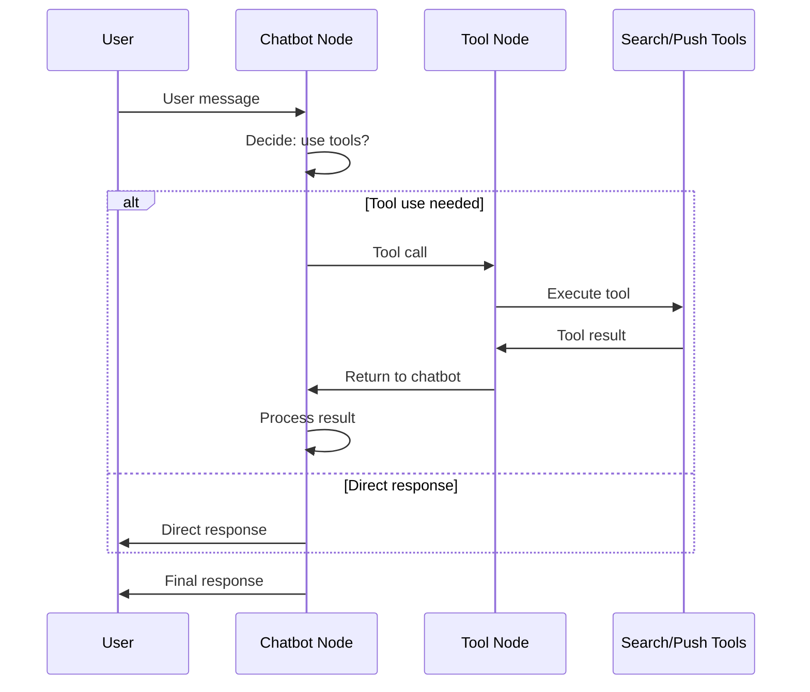

#### Advanced Features:

##### **1. Tool Integration Pattern**
```python
# Tool creation using LangChain wrappers
tool_search = Tool(
    name="search",
    func=serper.run,
    description="Useful for online search"
)

# LLM with tools binding
llm_with_tools = llm.bind_tools(tools)

# Conditional routing
graph_builder.add_conditional_edges(
    "chatbot", 
    tools_condition, 
    "tools"
)
```

##### **2. Memory Implementation**
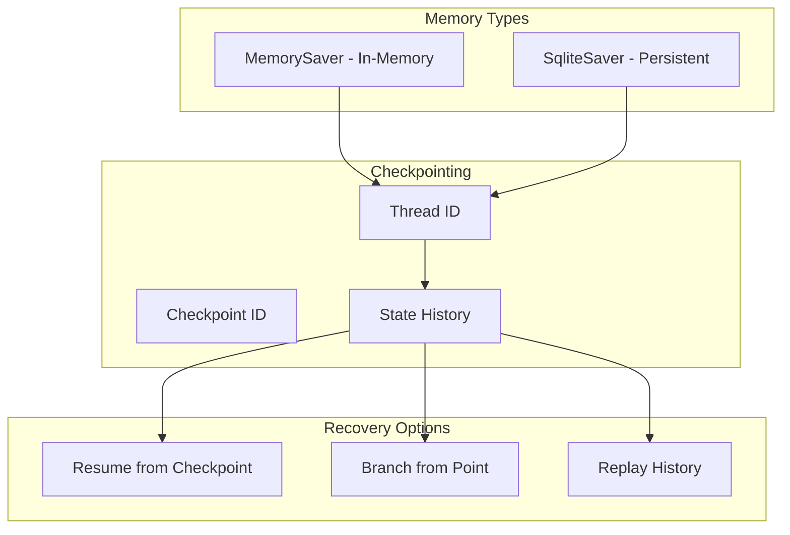

##### **3. Thread Management**
```python
config = {"configurable": {"thread_id": "1"}}
result = graph.invoke(state, config=config)

# Access conversation history
graph.get_state(config)
graph.get_state_history(config)
```

#### Commercial Implications:
- **Persistent Conversations**: Users can return to previous sessions
- **Error Recovery**: System can resume from any checkpoint
- **Audit Trails**: Complete conversation history for compliance

---

### Lab 3: Web Automation with Playwright
**File:** [`3_lab3.ipynb`](3_lab3.ipynb)

Integration of web automation capabilities using Playwright browser tools.

#### Web Automation Architecture:
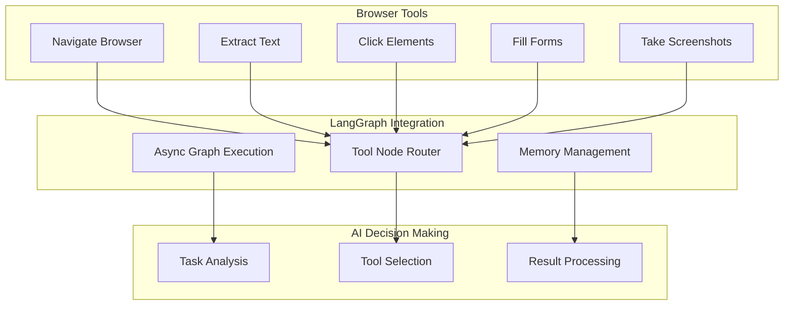

#### Key Technical Features:

##### **1. Async Playwright Integration**
```python
# Browser setup
async_browser = create_async_playwright_browser(headless=False)
toolkit = PlayWrightBrowserToolkit.from_browser(async_browser=async_browser)

# Async graph execution
async def chat(user_input: str, history):
    result = await graph.ainvoke(state, config=config)
    return result["messages"][-1].content
```

##### **2. Tool Ecosystem**
- **Browser Navigation**: URL navigation and page interaction
- **Content Extraction**: Text and data retrieval from web pages
- **Push Notifications**: Real-time user alerts
- **Memory Persistence**: Conversation continuity

##### **3. Nested Event Loop Handling**
```python
import nest_asyncio
nest_asyncio.apply()  # Enables nested async execution in notebooks
```

#### Business Applications:
- **Web Scraping**: Automated data collection
- **Process Automation**: Form filling and submissions
- **Monitoring Systems**: Automated website checking
- **Research Tools**: Information gathering from multiple sources

---

### Lab 4: Multi-Agent Evaluation System
**File:** [`4_lab4.ipynb`](4_lab4.ipynb)

Sophisticated multi-agent system with worker-evaluator pattern and structured outputs.

#### Multi-Agent Architecture:
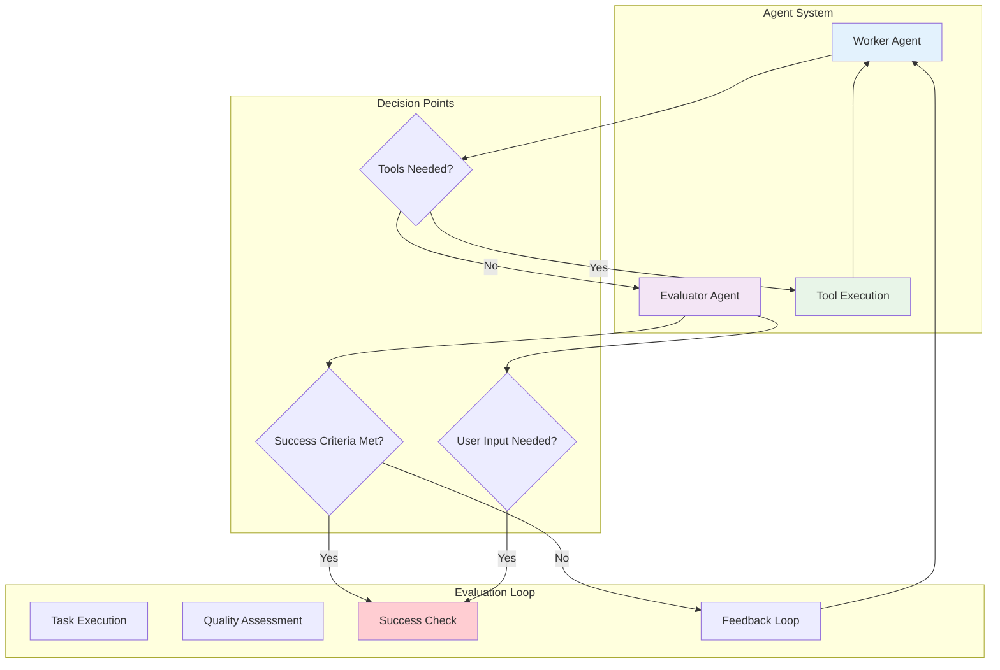

#### Advanced Components:

##### **1. Structured Output Definition**
```python
class EvaluatorOutput(BaseModel):
    feedback: str = Field(description="Feedback on response")
    success_criteria_met: bool = Field(description="Whether criteria met")
    user_input_needed: bool = Field(description="If user input required")
```

##### **2. Enhanced State Management**
```python
class State(TypedDict):
    messages: Annotated[List[Any], add_messages]
    success_criteria: str
    feedback_on_work: Optional[str]
    success_criteria_met: bool
    user_input_needed: bool
```

##### **3. Conditional Routing Logic**
```python
def worker_router(state: State) -> str:
    last_message = state["messages"][-1]
    if hasattr(last_message, "tool_calls") and last_message.tool_calls:
        return "tools"
    else:
        return "evaluator"

def route_based_on_evaluation(state: State) -> str:
    if state["success_criteria_met"] or state["user_input_needed"]:
        return "END"
    else:
        return "worker"
```

#### Quality Assurance Features:
- **Automated Evaluation**: AI evaluates its own work
- **Feedback Loops**: Continuous improvement through iteration
- **Success Criteria**: Clear objective measurement
- **User Intervention**: Graceful handling of complex cases

---

## 🚀 Production Application: The Sidekick
**Directory:** [`The Sidekick/`](The%20Sidekick/)

A production-ready AI assistant that combines all learned concepts into a powerful, autonomous task execution system.

### System Architecture:
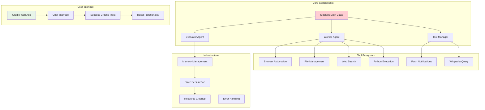

### Production Features:

#### **1. Comprehensive Tool Integration**
```python
async def other_tools():
    return [
        push_tool,           # Notifications
        tool_search,         # Web search
        wiki_tool,          # Wikipedia
        *file_tools,        # File operations
        # python_repl       # Code execution
    ]
```

#### **2. Advanced State Management**
```python
class Sidekick:
    async def run_superstep(self, message, success_criteria, history):
        config = {
            "configurable": {"thread_id": self.sidekick_id},
            "recursion_limit": 40
        }
        # Autonomous execution with quality control
```

#### **3. Resource Management**
```python
def cleanup(self):
    # Proper browser and Playwright cleanup
    # Async resource management
    # Exception handling
```

#### **4. Production UI Features**
- **State Management**: Persistent sidekick instances
- **Resource Cleanup**: Automatic cleanup callbacks
- **Success Criteria**: User-defined task objectives
- **Reset Functionality**: Fresh session initialization

### Capabilities Demonstrated:
- **Web Research**: Browse websites and extract information
- **File Operations**: Create, read, write, and manage files
- **Code Execution**: Run Python scripts with output capture
- **Information Retrieval**: Search web and Wikipedia
- **User Communication**: Push notifications and chat interface
- **Quality Assurance**: Self-evaluation and improvement

---

## 🏗️ LangGraph Architecture Patterns

### 1. Basic State Machine Pattern
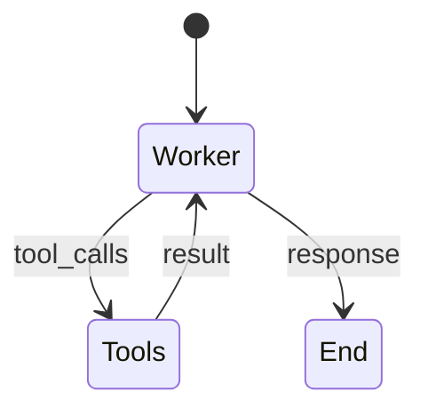

**Used in**: Lab 1, Lab 2
- Simple linear workflows
- Basic tool integration
- Direct user interaction

### 2. Evaluation Loop Pattern
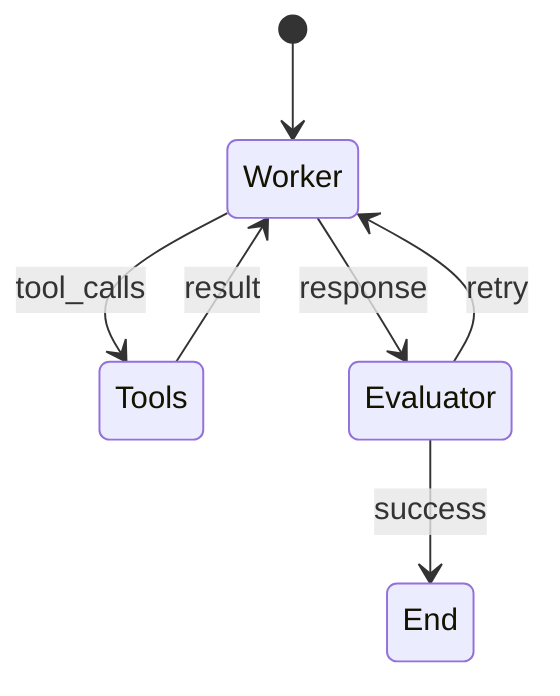

**Used in**: Lab 4, The Sidekick
- Quality assurance workflows
- Iterative improvement
- Success criteria validation

### 3. Conditional Routing Pattern
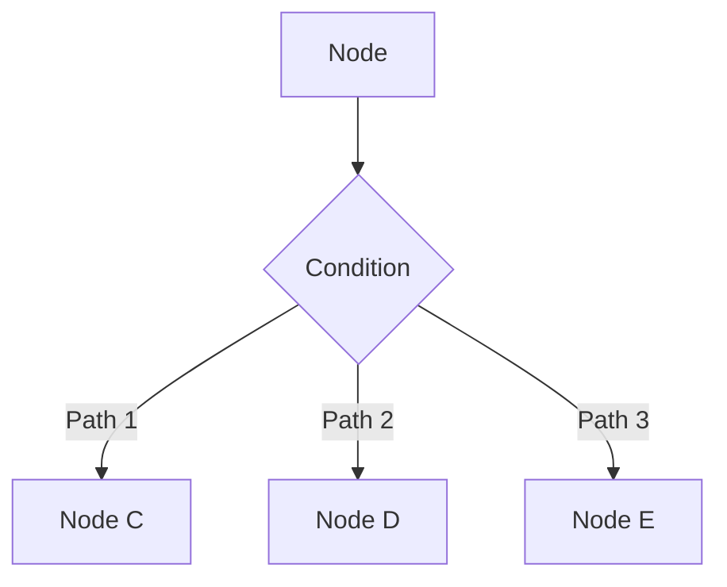

**Used throughout**: Dynamic workflow control based on state
- `tools_condition`: Route to tools or continue
- `worker_router`: Choose between tools and evaluation
- `route_based_on_evaluation`: Continue or end based on results

### 4. Memory Integration Pattern
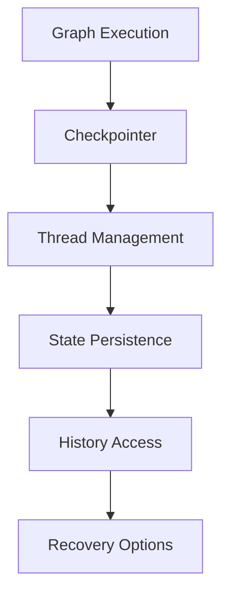

**Features**:
- Thread-based conversation management
- Checkpoint recovery and branching
- State history and audit trails

## 💼 Commercial Applications

### 1. **Customer Support Automation**
- **Autonomous Issue Resolution**: Sidekick can research, analyze, and solve customer problems
- **Quality Assurance**: Self-evaluation ensures response quality
- **Escalation Management**: Knows when to request human intervention

### 2. **Research and Analysis Services**
- **Web Research**: Automated information gathering from multiple sources
- **Report Generation**: Create comprehensive reports with file operations
- **Data Validation**: Multi-agent verification of findings

### 3. **Business Process Automation**
- **Form Processing**: Web automation for data entry and submission
- **Document Management**: File operations with intelligent processing
- **Workflow Orchestration**: Complex multi-step business processes

### 4. **Development and Testing**
- **Code Generation**: Python REPL for dynamic programming
- **Quality Assurance**: Automated testing and validation
- **Documentation**: Automatic documentation generation

### 5. **Monitoring and Alerting**
- **System Monitoring**: Web scraping for status checking
- **Alert Management**: Push notifications for important events
- **Incident Response**: Automated investigation and reporting

## 📈 Key Learnings

### Technical Insights:

#### 1. **LangGraph Design Principles**
- **State-Centric**: Everything revolves around state management
- **Functional Nodes**: Pure functions for predictable behavior
- **Conditional Routing**: Dynamic workflow control
- **Memory Integration**: Persistent state across sessions

#### 2. **Multi-Agent Coordination**
- **Role Specialization**: Different agents for different capabilities
- **Quality Control**: Evaluation agents for output validation
- **Feedback Loops**: Iterative improvement through self-evaluation
- **Resource Management**: Proper cleanup and error handling

#### 3. **Production Considerations**
- **Async Operations**: Essential for web automation and UI responsiveness
- **Error Handling**: Graceful degradation and recovery
- **Resource Cleanup**: Prevent memory leaks and zombie processes
- **State Persistence**: Resume conversations and workflows

### Business Insights:

#### 1. **Autonomous Task Execution**
- **Success Criteria**: Clear objectives enable autonomous operation
- **Quality Assurance**: Self-evaluation reduces manual oversight
- **Escalation Handling**: Systems know when to ask for help

#### 2. **Workflow Orchestration**
- **Complex Processes**: Multi-step workflows with decision points
- **Tool Integration**: Combine multiple capabilities seamlessly
- **State Management**: Track progress through complex operations

#### 3. **User Experience**
- **Conversational Interface**: Natural language task specification
- **Progress Tracking**: Users understand what's happening
- **Control Mechanisms**: Reset, retry, and intervention options

### Best Practices:

#### 1. **Development Workflow**
- **Start Simple**: Begin with basic state machines
- **Add Complexity Gradually**: Layer on features incrementally
- **Test Each Component**: Validate nodes independently
- **Monitor State Changes**: Use tracing and debugging tools

#### 2. **Production Deployment**
- **Resource Management**: Implement proper cleanup
- **Error Boundaries**: Handle failures gracefully
- **Performance Monitoring**: Track execution times and costs
- **User Safety**: Implement guardrails and limits

#### 3. **Agent Design**
- **Clear Instructions**: Specific, detailed system prompts
- **Tool Integration**: Provide necessary capabilities
- **Evaluation Criteria**: Define success objectively
- **Feedback Mechanisms**: Enable continuous improvement

---

## 🔗 Navigation Links

- [🏠 Back to Main Repository](../README.md)
- [📂 View Lab Notebooks](.)
- [🚀 Run The Sidekick](The%20Sidekick/app.py)
- [🌐 Community Contributions](community_contributions/)
- [📊 Sandbox Files](sandbox/)
- [📖 LangGraph Documentation](https://langchain-ai.github.io/langgraph/)

---

## 🚀 Getting Started

1. **Follow the Setup Instructions** to install dependencies
2. **Start with Lab 1** to understand LangGraph basics
3. **Progress through each lab** to build complexity
4. **Run The Sidekick** to see the complete system in action
5. **Customize for your use case** using the patterns learned

## 🎯 Next Steps

After mastering LangGraph, you're ready to:
- Build custom multi-agent workflows for your domain
- Integrate with enterprise systems and APIs
- Create production-ready AI applications
- Implement sophisticated quality assurance systems

*This module demonstrates the power of LangGraph for building sophisticated, stateful AI applications that can handle complex, real-world tasks with minimal human oversight.*
