# 🤖 AutoGen Multi-Agent Systems: Advanced Agent Orchestration Framework

This repository demonstrates the comprehensive capabilities of Microsoft's AutoGen framework for building sophisticated multi-agent systems. The collection progresses from basic agent interactions through distributed runtime orchestration to autonomous agent creation and collaboration.

## 📋 Table of Contents

- [🎯 Overview](#-overview)
- [🔧 Setup and Requirements](#-setup-and-requirements)
- [📚 Learning Journey](#-learning-journey)
  - [Lab 1: AutoGen AgentChat Fundamentals](#lab-1-autogen-agentchat-fundamentals)
  - [Lab 2: Advanced Features & Team Interactions](#lab-2-advanced-features--team-interactions)
  - [Lab 3: AutoGen Core Architecture](#lab-3-autogen-core-architecture)
  - [Lab 4: Distributed Runtime Systems](#lab-4-distributed-runtime-systems)
- [🚀 Production Applications](#-production-applications)
- [🏗️ AutoGen Architecture Patterns](#️-autogen-architecture-patterns)
- [💼 Commercial Applications](#-commercial-applications)
- [📈 Key Learnings](#-key-learnings)

## 🎯 Overview

This collection showcases the evolution from simple agent-to-agent interactions to sophisticated distributed systems capable of:
- Multi-modal conversation with images and structured outputs
- Tool integration with LangChain and MCP (Model Context Protocol)
- Team-based agent collaboration with evaluation loops
- Distributed runtime orchestration across multiple workers
- Autonomous agent creation and meta-programming capabilities

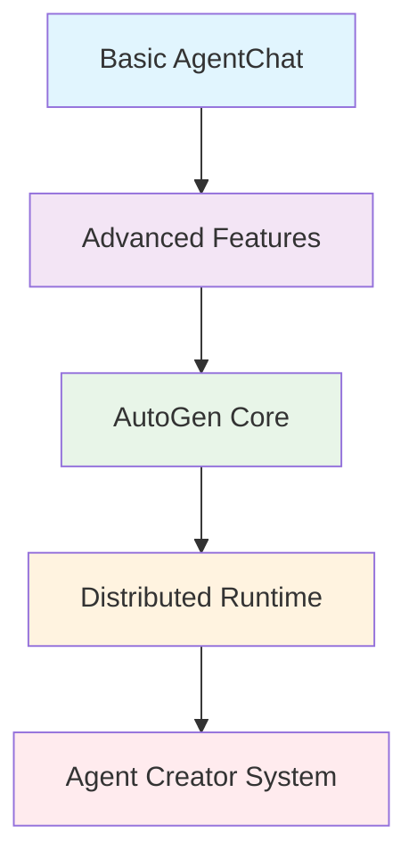

## 🔧 Setup and Requirements

### Prerequisites
- Python 3.8+
- OpenAI API Key
- Optional: SerperDev API, MCP servers, Playwright

### Installation
```bash
# Core AutoGen packages
pip install autogen-agentchat autogen-core autogen-ext

# Additional dependencies
pip install python-dotenv langchain-community
pip install playwright google-search-results

# MCP support
pip install uvx
```

### Environment Variables
Create a `.env` file with:
```env
OPENAI_API_KEY=your_openai_api_key
SERPER_API_KEY=your_serper_api_key        # For web search
LANGCHAIN_API_KEY=your_langchain_key      # Optional for tracing
```

## 📚 Learning Journey

### Lab 1: AutoGen AgentChat Fundamentals
**File:** [`1_lab_autogen_agentchat.ipynb`](1_lab_autogen_agentchat.ipynb)

Introduction to AutoGen's core concepts: model clients, agents, messages, and tool integration.

#### Core Architecture:
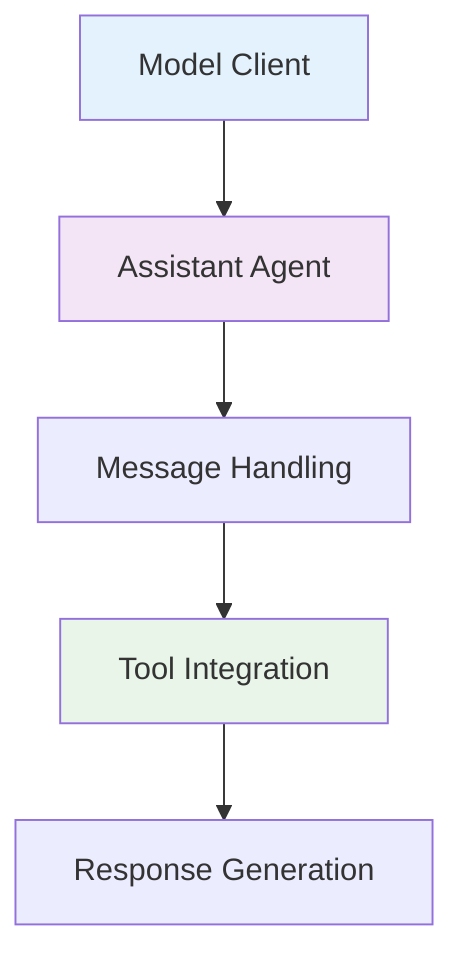

#### Key Concepts Introduced:

##### **1. Model Client Setup**
```python
from autogen_ext.models.openai import OpenAIChatCompletionClient
model_client = OpenAIChatCompletionClient(model='gpt-4.1-nano')
```

##### **2. Agent Creation Pattern**
```python
from autogen_agentchat.agents import AssistantAgent

agent = AssistantAgent(
    name="airline_agent",
    model_client=model_client,
    system_message="You are a helpful assistant for an airline",
    tools=[get_city_price],  # Direct function integration
    reflect_on_tool_use=True  # Self-reflection capability
)
```

##### **3. Message Processing**
```python
from autogen_agentchat.messages import TextMessage
from autogen_core import CancellationToken

message = TextMessage(content="I love Paris!", source="user")
response = await agent.on_messages([message], cancellation_token=CancellationToken())
```

#### Business Application:
- **Airline Price Assistant**: SQLite database integration for ticket pricing
- **Tool Integration**: Direct Python function usage without wrappers
- **Reflection**: Agents can think about tool usage before responding

---

### Lab 2: Advanced Features & Team Interactions
**File:** [`2_lab_autogen_agentchat.ipynb`](2_lab_autogen_agentchat.ipynb)

Advanced capabilities including multi-modal processing, structured outputs, and team collaboration.

#### Multi-Modal Architecture:
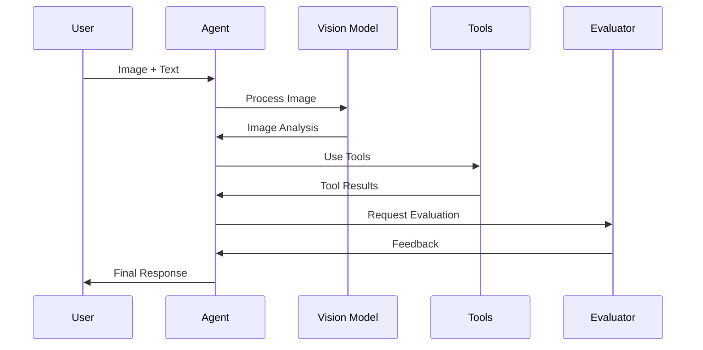

#### Advanced Features:

##### **1. Multi-Modal Processing**
```python
from autogen_core import Image as AGImage
from autogen_agentchat.messages import MultiModalMessage

# Image processing
pil_image = Image.open(BytesIO(requests.get(url).content))
img = AGImage(pil_image)
multi_modal_message = MultiModalMessage(
    content=["Describe this image in detail", img], 
    source="User"
)
```

##### **2. Structured Outputs**
```python
from pydantic import BaseModel, Field

class ImageDescription(BaseModel):
    scene: str = Field(..., description="Overall scene description")
    message: str = Field(description="Key message conveyed")
    style: str = Field(description="Artistic style")
    orientation: Literal["portrait", "landscape", "square"]

# Agent with structured output
describer = AssistantAgent(
    name="describer",
    model_client=model_client,
    output_content_type=ImageDescription
)
```

##### **3. LangChain Tool Integration**
```python
from autogen_ext.tools.langchain import LangChainToolAdapter
from langchain_community.utilities import GoogleSerperAPIWrapper

# Convert LangChain tools to AutoGen format
serper = GoogleSerperAPIWrapper()
langchain_serper = Tool(name="search", func=serper.run, ...)
autogen_serper = LangChainToolAdapter(langchain_serper)
```

##### **4. Team Collaboration System**
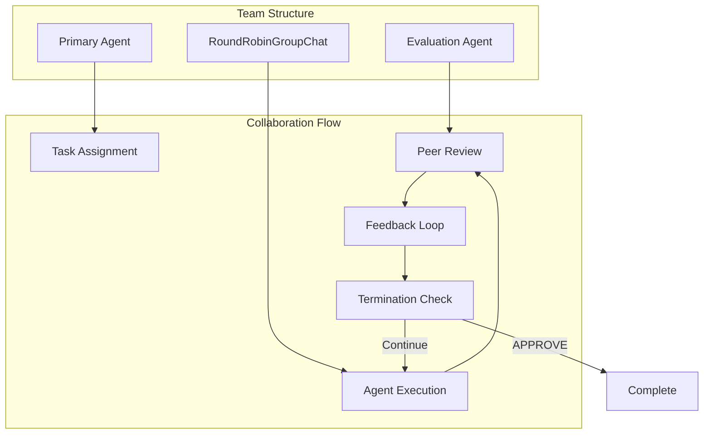

##### **5. MCP Integration**
```python
from autogen_ext.tools.mcp import StdioServerParams, mcp_server_tools

# MCP server integration
fetch_mcp_server = StdioServerParams(
    command='uvx', 
    args=['mcp-server-fetch']
)
fetcher = await mcp_server_tools(fetch_mcp_server)

agent = AssistantAgent(
    name="fetcher",
    model_client=model_client,
    tools=[fetcher],
    reflect_on_tool_use=True
)
```

#### Key Innovations:
- **Conversational Memory**: Agents maintain context across interactions
- **Peer Review**: Evaluation agents provide feedback until approval
- **MCP Protocol**: Integration with external tool servers
- **File Management**: Automated file operations through LangChain tools

---

### Lab 3: AutoGen Core Architecture
**File:** [`3_lab_autogen_core.ipynb`](3_lab_autogen_core.ipynb)

Low-level framework for building custom agent communication systems.

#### AutoGen Core Architecture:
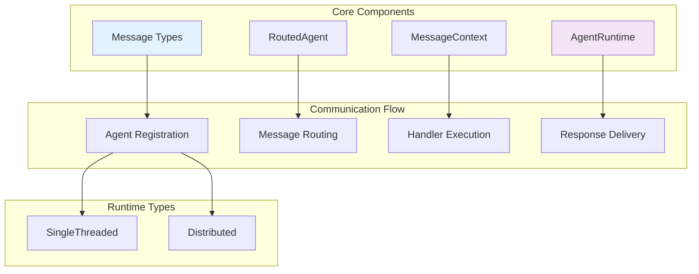

#### Core Concepts:

##### **1. Message Definition**
```python
from dataclasses import dataclass

@dataclass
class Message:
    content: str
```

##### **2. Agent Implementation**
```python
from autogen_core import RoutedAgent, message_handler

class SimpleAgent(RoutedAgent):
    def __init__(self) -> None:
        super().__init__(("Simple"))

    @message_handler
    async def on_my_message(self, message: Message, ctx: MessageContext) -> Message:
        return Message(content=f"You said '{message.content}' and I disagree.")
```

##### **3. Runtime Management**
```python
from autogen_core import SingleThreadedAgentRuntime

runtime = SingleThreadedAgentRuntime()
await SimpleAgent.register(runtime, "simple_agent", lambda: SimpleAgent())
runtime.start()

# Send messages
agent_id = AgentId("simple_agent", "default")
response = await runtime.send_message(Message("Hello!"), agent_id)
```

##### **4. Multi-Agent Game Example**
```python
class RockPaperScissorsAgent(RoutedAgent):
    @message_handler
    async def handle_my_message_type(self, message: Message, ctx: MessageContext):
        # Coordinate between Player1 and Player2
        inner_1 = AgentId("player1", "default")
        inner_2 = AgentId("player2", "default")
        response1 = await self.send_message(instruction, inner_1)
        response2 = await self.send_message(instruction, inner_2)
        # Judge the results
        return Message(content=result + judgment)
```

#### Architecture Benefits:
- **Decoupled Communication**: Agent logic separate from message delivery
- **Flexible Routing**: Custom message handling patterns
- **Runtime Agnostic**: Works with different execution environments
- **Lifecycle Management**: Automatic agent registration and cleanup

---

### Lab 4: Distributed Runtime Systems
**File:** [`4_lab_autogen_distributed_runtime.ipynb`](4_lab_autogen_distributed_runtime.ipynb)

Production-ready distributed agent systems using gRPC communication.

#### Distributed Architecture:
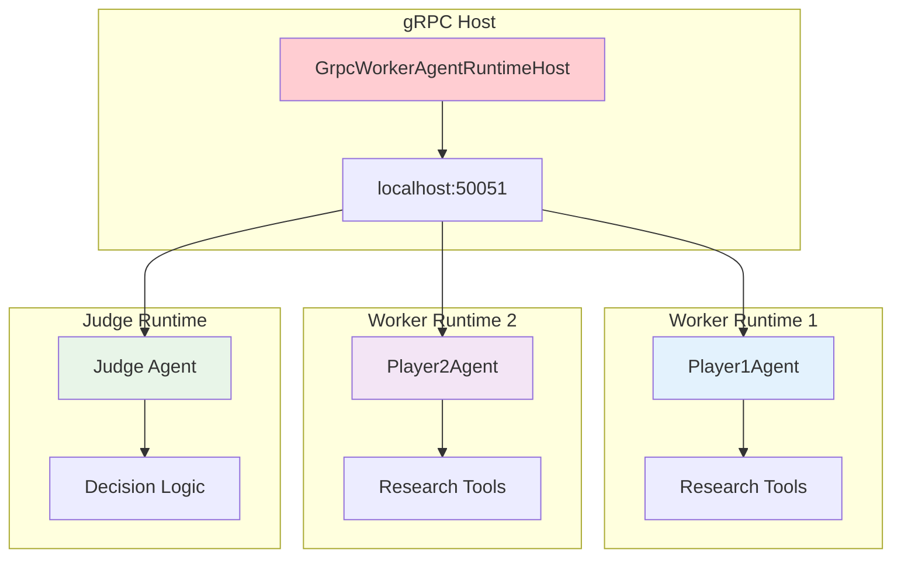

#### Distributed Features:

##### **1. gRPC Host Setup**
```python
from autogen_ext.runtimes.grpc import GrpcWorkerAgentRuntimeHost

host = GrpcWorkerAgentRuntimeHost(address="localhost:50051")
host.start()
```

##### **2. Worker Runtime Configuration**
```python
from autogen_ext.runtimes.grpc import GrpcWorkerAgentRuntime

# Option 1: All agents in one worker
if ALL_IN_ONE_WORKER:
    worker = GrpcWorkerAgentRuntime(host_address="localhost:50051")
    await worker.start()
    await Player1Agent.register(worker, "player1", ...)
    await Player2Agent.register(worker, "player2", ...)
    await Judge.register(worker, "judge", ...)

# Option 2: Distributed across multiple workers
else:
    worker1 = GrpcWorkerAgentRuntime(host_address="localhost:50051")
    worker2 = GrpcWorkerAgentRuntime(host_address="localhost:50051")
    worker3 = GrpcWorkerAgentRuntime(host_address="localhost:50051")
    # Each handles different agents
```

##### **3. Distributed Decision Making**
```python
class Judge(RoutedAgent):
    @message_handler
    async def handle_my_message_type(self, message, ctx):
        # Research pros and cons via distributed agents
        pros_response = await self.send_message(pros_task, agent1_id)
        cons_response = await self.send_message(cons_task, agent2_id)
        
        # Make decision based on distributed research
        decision_prompt = f"{pros_response.content}\n{cons_response.content}"
        final_decision = await self._delegate.on_messages([decision_prompt])
        return Message(content=final_decision)
```

#### Production Benefits:
- **Scalability**: Agents can run on different machines
- **Fault Tolerance**: Individual worker failures don't crash the system
- **Resource Distribution**: Spread computational load
- **Service Architecture**: Microservices pattern for agent systems

---

## 🚀 Production Applications

### MCP Integration Application
**File:** [`2_autogen_MCP.py`](2_autogen_MCP.py)

Production-ready MCP (Model Context Protocol) integration for web scraping and content analysis.

```python
async def main():
    fetch_mcp_server = StdioServerParams(
        command='uvx', 
        args=['mcp-server-fetch'], 
        read_timeout_seconds=30
    )
    fetcher = await mcp_server_tools(fetch_mcp_server)
    
    agent = AssistantAgent(
        name="fetcher",
        model_client=model_client,
        tools=fetcher,
        reflect_on_tool_use=True
    )
    
    result = await agent.run(task="Review website and analyze content")
```

### Agent Creator System
**Directory:** [`Agent Creator/`](Agent%20Creator/)

Revolutionary autonomous agent creation and collaboration system.

#### Meta-Programming Architecture:
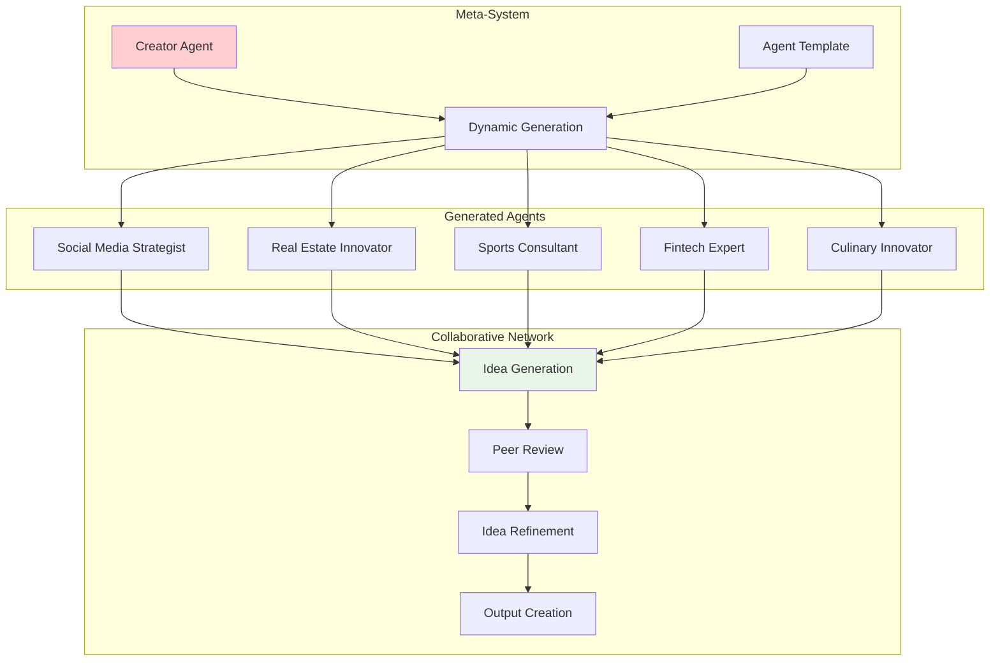

#### System Components:

##### **1. Creator Agent**
```python
class Creator(RoutedAgent):
    async def create_agent(self, agent_number: int):
        # Read template
        with open("agent.py", "r") as f:
            template = f.read()
        
        # Generate unique system message
        unique_agent_code = await self._generate_agent_code(template)
        
        # Save and dynamically import
        with open(f"agent{agent_number}.py", "w") as f:
            f.write(unique_agent_code)
        
        # Register with runtime
        agent_module = importlib.import_module(f"agent{agent_number}")
        await agent_module.Agent.register(
            self._runtime, 
            f"agent{agent_number}", 
            lambda: agent_module.Agent(f"agent{agent_number}")
        )
```

##### **2. Collaborative Idea Generation**
```python
class Agent(RoutedAgent):
    @message_handler
    async def handle_message(self, message, ctx):
        # Generate initial idea
        response = await self._delegate.on_messages([text_message])
        idea = response.chat_message.content
        
        # Probabilistic collaboration
        if random.random() < self.CHANCES_THAT_I_BOUNCE_IDEA_OFF_ANOTHER:
            recipient = messages.find_recipient()
            refinement_request = f"Please refine this idea: {idea}"
            response = await self.send_message(
                Message(content=refinement_request), 
                recipient
            )
            idea = response.content
        
        return Message(content=idea)
```

#### Generated Agent Examples:
- **Social Media Strategist**: Entertainment & E-commerce focus
- **Real Estate Innovator**: Property technology specialist  
- **Sports Consultant**: Athletic performance optimization
- **Fintech Expert**: Financial technology innovation
- **Culinary Innovator**: Food industry transformation

#### System Capabilities:
- **Meta-Programming**: Agents create other agents autonomously
- **Diverse Specialization**: Each generated agent has unique expertise
- **Collaborative Refinement**: Agents improve each other's ideas
- **Distributed Execution**: Runs across multiple runtime workers
- **Emergent Creativity**: Unexpected collaborations and innovations

---

## 🏗️ AutoGen Architecture Patterns

### 1. Direct Agent Communication
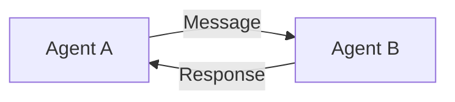

**Used in**: Lab 1, Lab 3
- Simple request-response patterns
- Direct tool integration
- Immediate feedback loops

### 2. Team-Based Collaboration  
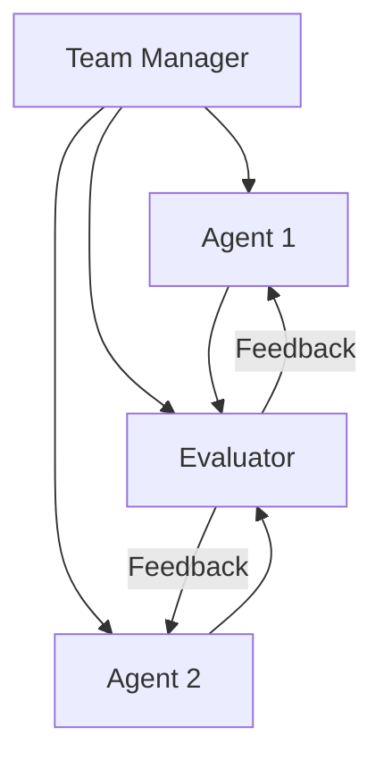

**Used in**: Lab 2
- Round-robin group chats
- Peer evaluation systems
- Consensus building mechanisms

### 3. Runtime-Mediated Communication
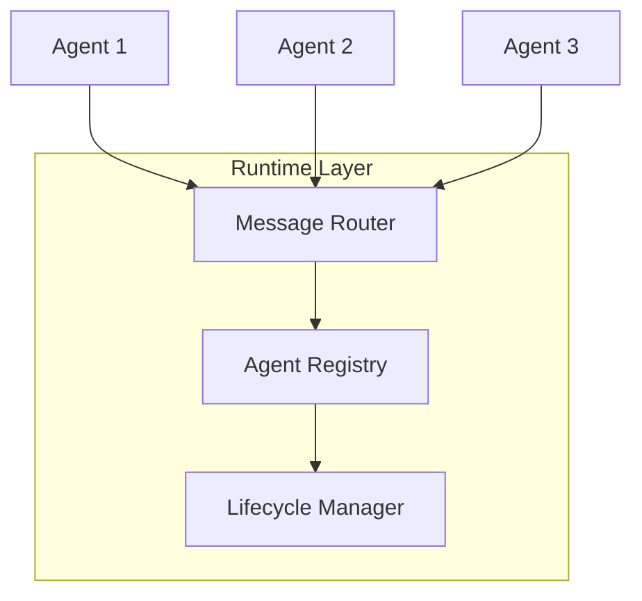

**Used in**: Lab 3, Lab 4
- Decoupled agent communication
- Flexible message routing
- Distributed execution support

### 4. Distributed Multi-Runtime
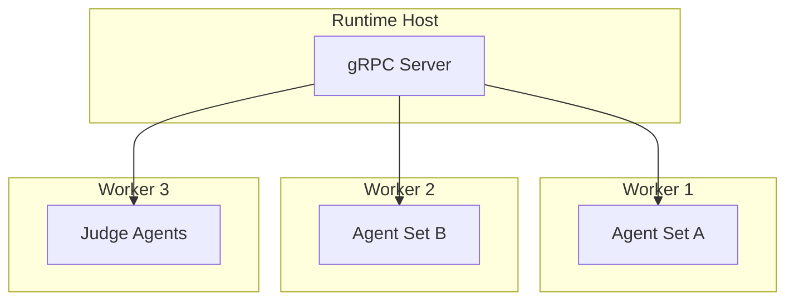

**Used in**: Lab 4, Agent Creator
- Production scalability
- Fault tolerance
- Resource distribution
- Service architecture

### 5. Meta-Programming Pattern
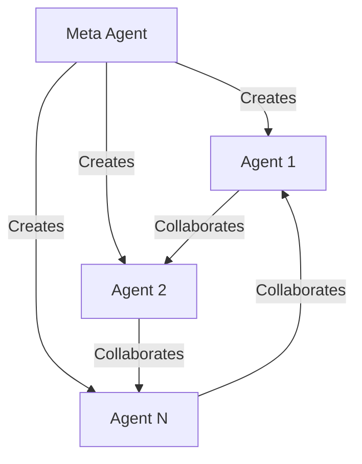

**Used in**: Agent Creator
- Autonomous agent generation
- Dynamic system expansion
- Emergent collaboration networks

## 💼 Commercial Applications

### 1. **Customer Service Orchestration**
- **Multi-Agent Support**: Specialized agents for different inquiry types
- **Escalation Management**: Automatic routing to human agents
- **Knowledge Integration**: Real-time access to documentation and databases
- **Quality Assurance**: Peer review and evaluation systems

### 2. **Research and Analysis Services**
- **Distributed Research**: Multiple agents researching different aspects
- **Collaborative Analysis**: Agents building on each other's findings
- **Multi-Modal Processing**: Text, image, and document analysis
- **Structured Reporting**: Automated report generation with validation

### 3. **Creative Content Generation**
- **Idea Brainstorming**: Multiple creative agents generating concepts
- **Collaborative Refinement**: Agents improving each other's work
- **Multi-Domain Expertise**: Specialists in different creative areas
- **Quality Control**: Evaluation and feedback loops

### 4. **Decision Support Systems**
- **Multi-Perspective Analysis**: Pros and cons from different viewpoints
- **Distributed Evaluation**: Parallel analysis of options
- **Consensus Building**: Collaborative decision-making processes
- **Risk Assessment**: Comprehensive evaluation frameworks

### 5. **Business Process Automation**
- **Task Orchestration**: Complex multi-step business processes
- **Exception Handling**: Intelligent error recovery and escalation
- **Integration Services**: Connecting multiple business systems
- **Performance Monitoring**: Continuous system optimization

## 📈 Key Learnings

### Technical Insights:

#### 1. **AutoGen Design Philosophy**
- **Agent-Centric**: Focus on autonomous agent capabilities
- **Communication First**: Sophisticated message routing and handling
- **Tool Integration**: Seamless integration with external services
- **Runtime Flexibility**: Support for different execution environments

#### 2. **Framework Capabilities**
- **Multi-Modal Support**: Text, images, and structured data
- **Tool Ecosystem**: LangChain, MCP, and custom tool integration  
- **Distributed Execution**: Production-ready scalability
- **Meta-Programming**: Agents creating and managing other agents

#### 3. **Production Considerations**
- **State Management**: Conversation history and context preservation
- **Error Handling**: Robust failure recovery mechanisms
- **Resource Management**: Efficient use of computational resources
- **Monitoring**: Comprehensive logging and performance tracking

### Business Insights:

#### 1. **Collaboration Advantages**
- **Diverse Perspectives**: Multiple agents provide different viewpoints
- **Quality Assurance**: Peer review improves output quality
- **Specialization**: Agents can focus on specific domains
- **Scalability**: Easy addition of new capabilities

#### 2. **Distributed Benefits**
- **Fault Tolerance**: System resilience through distribution
- **Resource Optimization**: Efficient use of available hardware
- **Service Architecture**: Microservices approach to agent systems
- **Geographic Distribution**: Agents can run across locations

#### 3. **Meta-Programming Potential**
- **Self-Improving Systems**: Agents that enhance themselves
- **Dynamic Adaptation**: Systems that evolve based on needs
- **Emergent Capabilities**: Unexpected combinations and innovations
- **Autonomous Scaling**: Systems that grow without manual intervention

### Best Practices:

#### 1. **Development Approach**
- **Start Simple**: Begin with basic agent interactions
- **Add Complexity Gradually**: Layer on advanced features incrementally
- **Test Collaboration**: Validate agent-to-agent communication
- **Monitor Performance**: Track system behavior and optimize

#### 2. **Production Deployment**
- **Design for Distribution**: Plan for multi-runtime scenarios
- **Implement Monitoring**: Comprehensive logging and metrics
- **Handle Failures Gracefully**: Robust error recovery
- **Plan for Growth**: Scalable architecture from the start

#### 3. **Agent Design**
- **Clear Roles**: Well-defined agent responsibilities
- **Appropriate Tools**: Match tools to agent capabilities
- **Effective Communication**: Clear message protocols
- **Quality Control**: Built-in evaluation and feedback mechanisms

---

## 🔗 Navigation Links

- [🏠 Back to Main Repository](../README.md)
- [📂 View Lab Notebooks](.)
- [🤖 Agent Creator System](Agent%20Creator/)
- [🔧 MCP Integration](2_autogen_MCP.py)
- [📊 Sandbox Examples](sandbox/)
- [📖 AutoGen Documentation](https://microsoft.github.io/autogen/)

---

## 🚀 Getting Started

1. **Install Dependencies** following the setup instructions
2. **Start with Lab 1** to understand AutoGen fundamentals
3. **Progress through Labs 2-4** to build complexity
4. **Explore Agent Creator** to see autonomous agent generation
5. **Build Custom Systems** using the patterns learned

## 🎯 Next Steps

After mastering AutoGen, you're ready to:
- Build enterprise-scale multi-agent systems
- Create autonomous agent networks
- Implement distributed AI architectures
- Develop self-improving AI systems

*This module demonstrates AutoGen's power for creating sophisticated, scalable, and autonomous multi-agent systems that can handle complex real-world challenges with minimal human oversight.*
