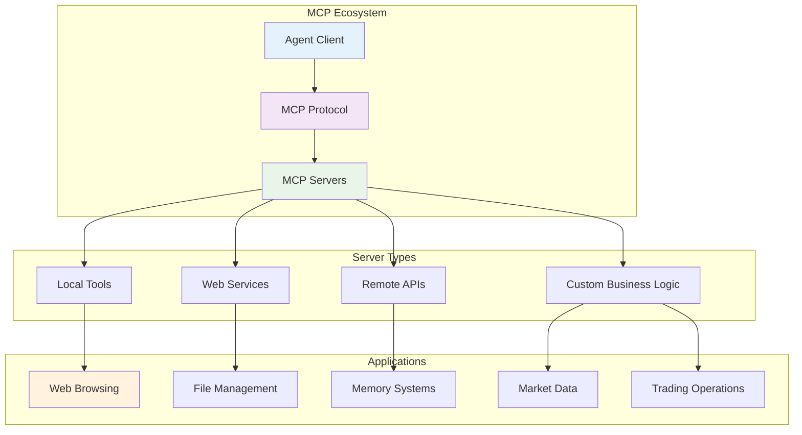
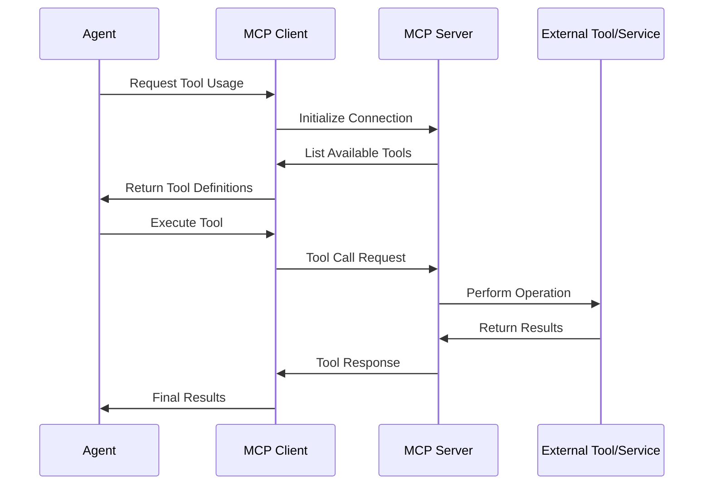
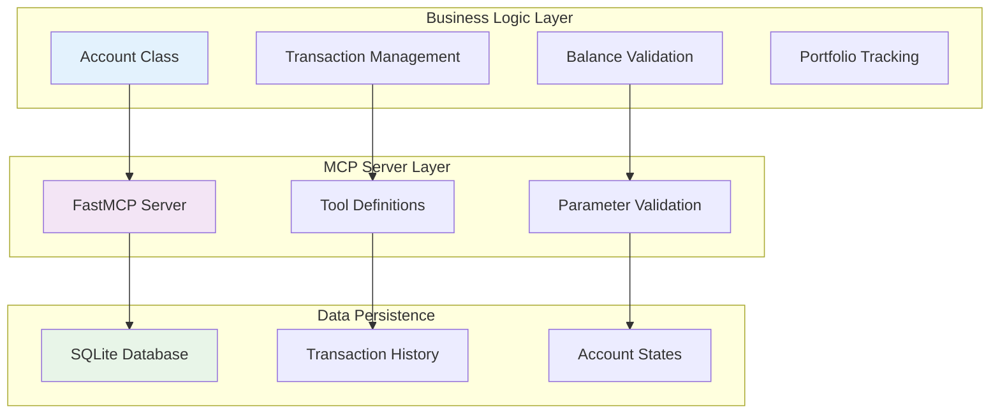
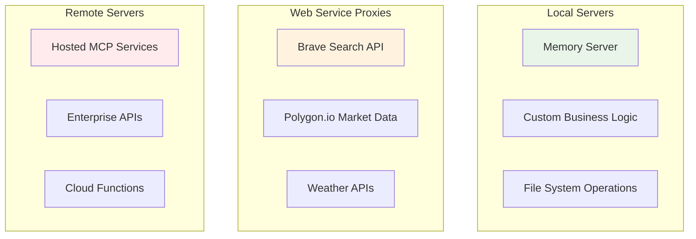
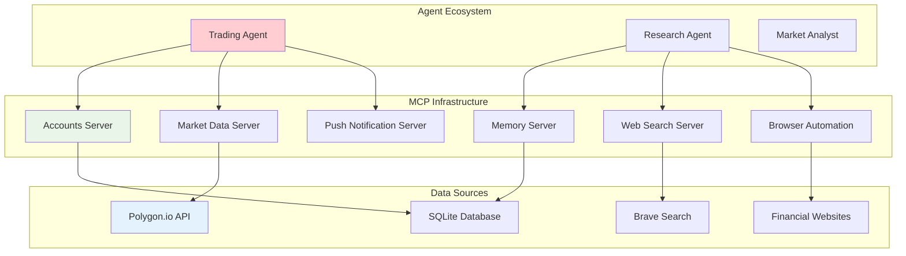
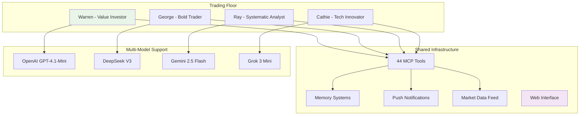

# 🔌 Model Context Protocol (MCP): Advanced Agent-Tool Integration

This comprehensive exploration demonstrates the power of the Model Context Protocol (MCP) for building sophisticated agent systems with external tool integration. The journey progresses from basic MCP concepts through custom server development to autonomous trading systems powered by multiple MCP servers.

## 📋 Table of Contents

- [🎯 Overview](#-overview)
- [🛠️ MCP Architecture](#️-mcp-architecture)
- [📚 Learning Journey](#-learning-journey)
  - [Lab 1: MCP Fundamentals](#lab-1-mcp-fundamentals)
  - [Lab 2: Custom MCP Server Development](#lab-2-custom-mcp-server-development)
  - [Lab 3: MCP Server Types & Integration](#lab-3-mcp-server-types--integration)
  - [Lab 4: Multi-Agent Trading Environment](#lab-4-multi-agent-trading-environment)
  - [Lab 5: Autonomous Trading Floor](#lab-5-autonomous-trading-floor)
- [🏗️ Custom MCP Servers](#️-custom-mcp-servers)
- [🚀 Production Applications](#-production-applications)
- [💼 Commercial Applications](#-commercial-applications)
- [📈 Key Learnings](#-key-learnings)

## 🎯 Overview

The Model Context Protocol (MCP) revolutionizes how AI agents interact with external tools and services. This collection showcases:

- **Tool Integration**: Seamless connection between agents and external services
- **Custom Server Development**: Building domain-specific MCP servers
- **Multi-Server Orchestration**: Coordinating multiple tool providers
- **Production-Ready Systems**: Autonomous trading environments with real-time data
- **Cross-Platform Compatibility**: Solutions for Windows, Mac, and Linux deployment



## 🛠️ MCP Architecture

### Core Components



### Protocol Benefits
- **Standardization**: Unified interface for diverse tools
- **Discoverability**: Automatic tool listing and documentation
- **Security**: Controlled access and permission management
- **Scalability**: Easy addition of new tools and services
- **Portability**: Cross-platform compatibility

## 📚 Learning Journey

### Lab 1: MCP Fundamentals
**File:** [`1_lab1.ipynb`](1_lab1.ipynb)

Introduction to MCP servers, tool discovery, and basic agent-tool integration.

#### Essential MCP Servers:

##### **1. Fetch Server (Web Browsing)**
```python
fetch_params = {"command": "uvx", "args": ["mcp-server-fetch"]}

async with MCPServerStdio(params=fetch_params, client_session_timeout_seconds=60) as server:
    fetch_tools = await server.list_tools()
```

**Capabilities**: Web page fetching, content extraction, cookie handling

##### **2. Playwright Server (Browser Automation)**
```python
playwright_params = {"command": "npx", "args": ["@playwright/mcp@latest"]}

async with MCPServerStdio(params=playwright_params, client_session_timeout_seconds=60) as server:
    playwright_tools = await server.list_tools()
```

**Capabilities**: Advanced web automation, JavaScript execution, screenshot capture

##### **3. Filesystem Server (File Operations)**
```python
sandbox_path = os.path.abspath(os.path.join(os.getcwd(), "sandbox"))
files_params = {"command": "npx", "args": ["-y", "@modelcontextprotocol/server-filesystem", sandbox_path]}

async with MCPServerStdio(params=files_params, client_session_timeout_seconds=60) as server:
    file_tools = await server.list_tools()
```

**Capabilities**: File creation, reading, writing, directory operations

#### Agent Integration Pattern:
```python
instructions = """
You browse the internet to accomplish your instructions.
You are highly capable at browsing the internet independently to accomplish your task,
including accepting all cookies and clicking 'not now' as appropriate to get to the content you need.
"""

async with MCPServerStdio(params=files_params, client_session_timeout_seconds=60) as mcp_server_files:
    async with MCPServerStdio(params=playwright_params, client_session_timeout_seconds=60) as mcp_server_browser:
        agent = Agent(
            name="investigator",
            instructions=instructions,
            model="gpt-4.1-mini",
            mcp_servers=[mcp_server_files, mcp_server_browser]
        )
        result = await Runner.run(agent, "Find a great recipe for Banoffee Pie, then summarize it in markdown")
```

#### Platform Considerations:
- **Windows**: Requires WSL (Windows Subsystem for Linux) for optimal compatibility
- **Mac/Linux**: Native support for all MCP servers
- **Node.js Dependency**: Required for JavaScript-based MCP servers

---

### Lab 2: Custom MCP Server Development
**File:** [`2_lab2.ipynb`](2_lab2.ipynb)

Building custom MCP servers for domain-specific business logic and creating MCP clients.

#### Custom Accounts Server Architecture:



#### Account Management System:
```python
from accounts import Account

# Core business logic
account = Account.get("Ed")
account.buy_shares("AMZN", 3, "Because this bookstore website looks promising")
account.report()  # Portfolio summary
account.list_transactions()  # Transaction history
```

#### MCP Server Implementation:
```python
# accounts_server.py - Custom MCP Server
params = {"command": "uv", "args": ["run", "accounts_server.py"]}

async with MCPServerStdio(params=params, client_session_timeout_seconds=30) as server:
    mcp_tools = await server.list_tools()

# Agent with custom business tools
async with MCPServerStdio(params=params, client_session_timeout_seconds=30) as mcp_server:
    agent = Agent(
        name="account_manager",
        instructions="You are able to manage an account for a client, and answer questions about the account.",
        model="gpt-4.1-mini",
        mcp_servers=[mcp_server]
    )
    result = await Runner.run(agent, "My name is Ed. What's my balance and holdings?")
```

#### MCP Client Development:
```python
from accounts_client import get_accounts_tools_openai, read_accounts_resource, list_accounts_tools

# Direct MCP client integration
mcp_tools = await list_accounts_tools()
openai_tools = await get_accounts_tools_openai()

# Resource access
context = await read_accounts_resource("ed")

# Native OpenAI integration without Agents SDK
agent = Agent(name="account_manager", tools=openai_tools, model="gpt-4.1-mini")
```

#### Key Development Patterns:
- **Business Logic Separation**: Clean separation between domain logic and MCP interface
- **Resource Providers**: MCP servers can provide both tools and resources
- **Client Flexibility**: Same server can be accessed via multiple client interfaces
- **Data Persistence**: SQLite integration for stateful operations

---

### Lab 3: MCP Server Types & Integration
**File:** [`3_lab3.ipynb`](3_lab3.ipynb)

Exploration of different MCP server deployment models and external service integration.

#### MCP Server Classification:



#### Type 1: Local Processing Servers

##### **Knowledge Graph Memory**
```python
params = {"command": "npx", "args": ["-y", "mcp-memory-libsql"], "env": {"LIBSQL_URL": "file:./memory/jk.db"}}

async with MCPServerStdio(params=params, client_session_timeout_seconds=30) as server:
    mcp_tools = await server.list_tools()

instructions = "You use your entity tools as a persistent memory to store and recall information about your conversations."
```

**Features**: Entity storage, relationship mapping, persistent conversation context

#### Type 2: Web Service Integration

##### **Brave Search Integration**
```python
env = {"BRAVE_API_KEY": os.getenv("BRAVE_API_KEY")}
params = {"command": "npx", "args": ["-y", "@modelcontextprotocol/server-brave-search"], "env": env}

async with MCPServerStdio(params=params, client_session_timeout_seconds=60) as server:
    mcp_tools = await server.list_tools()
```

**Capabilities**: Web search, news retrieval, real-time information access

##### **Financial Market Data**
```python
# Custom market server with rate limiting
if is_paid_polygon or is_realtime_polygon:
    market_mcp = {
        "command": "uvx",
        "args": ["--from", "git+https://github.com/polygon-io/mcp_polygon@v0.1.0", "mcp_polygon"],
        "env": {"POLYGON_API_KEY": polygon_api_key}
    }
else:
    # Free tier with caching
    market_mcp = {"command": "uv", "args": ["run", "market_server.py"]}
```

**Features**: Real-time stock prices, market data, historical analysis

#### Type 3: Remote Servers
- **Enterprise Integration**: Business-specific hosted services
- **Cloud Functions**: Serverless MCP endpoints
- **Limited Availability**: Currently rare in the ecosystem

#### Development Best Practices:
- **API Key Management**: Secure credential handling via environment variables
- **Rate Limiting**: Intelligent caching for free-tier APIs
- **Error Handling**: Graceful degradation for service failures
- **Cost Management**: Tier-aware functionality

---

### Lab 4: Multi-Agent Trading Environment
**File:** [`4_lab4.ipynb`](4_lab4.ipynb)

Building a sophisticated autonomous trading system with specialized agents and multiple MCP servers.

#### Trading System Architecture:



#### Multi-Server Configuration:
```python
# Trader MCP servers
trader_mcp_server_params = [
    {"command": "uv", "args": ["run", "accounts_server.py"]},
    {"command": "uv", "args": ["run", "push_server.py"]},
    market_mcp  # Polygon.io integration
]

# Researcher MCP servers  
researcher_mcp_server_params = [
    {"command": "uvx", "args": ["mcp-server-fetch"]},
    {"command": "npx", "args": ["-y", "@modelcontextprotocol/server-brave-search"], "env": brave_env}
]
```

#### Specialized Agent Roles:

##### **Research Agent**
```python
async def get_researcher(mcp_servers) -> Agent:
    instructions = f"""You are a financial researcher. You are able to search the web for interesting financial news,
look for possible trading opportunities, and help with research.
Based on the request, you carry out necessary research and respond with your findings.
Take time to make multiple searches to get a comprehensive overview, and then summarize your findings.
The current datetime is {datetime.now().strftime("%Y-%m-%d %H:%M:%S")}"""
    
    return Agent(
        name="Researcher",
        instructions=instructions,
        model="gpt-4.1-mini",
        mcp_servers=mcp_servers,
    )
```

##### **Trading Agent**
```python
# Account-aware trading instructions
account_details = await read_accounts_resource(agent_name)
strategy = await read_strategy_resource(agent_name)

instructions = f"""
You are a trader that manages a portfolio of shares. Your name is {agent_name}.
Your investment strategy: {strategy}
Your current holdings: {account_details}

You have tools to:
- Search for company news and information
- Check stock prices
- Buy and sell shares
- Save memory of research and thinking
- Send push notifications about trades

Please make use of these tools to manage your portfolio. Carry out trades as you see fit;
do not wait for instructions or ask for confirmation.
"""
```

#### Agent-as-Tool Pattern:
```python
async def get_researcher_tool(mcp_servers) -> Tool:
    researcher = await get_researcher(mcp_servers)
    return researcher.as_tool(
        tool_name="Researcher",
        tool_description="This tool researches online for news and opportunities"
    )

# Integration with trader
researcher_tool = await get_researcher_tool(researcher_mcp_servers)
trader = Agent(
    name=agent_name,
    instructions=instructions,
    tools=[researcher_tool],
    mcp_servers=trader_mcp_servers,
    model="gpt-4o-mini",
)
```

#### Production Module Structure:
- `mcp_params.py`: Server configuration management
- `templates.py`: System prompts and message templates
- `traders.py`: Main trading agent implementation
- `accounts.py`: Trading account business logic
- `market.py`: Market data integration with caching

#### Context Manager Pattern:
```python
from contextlib import AsyncExitStack

async with AsyncExitStack() as stack:
    mcp_servers = [
        await stack.enter_async_context(MCPServerStdio(params))
        for params in mcp_server_params
    ]
    # Clean management of multiple MCP server connections
```

---

### Lab 5: Autonomous Trading Floor  
**File:** [`5_lab5.ipynb`](5_lab5.ipynb)

The grand finale: A complete autonomous trading floor with multiple trader personalities and real-time monitoring.

#### Trading Floor Architecture:



#### Trader Personalities:

##### **Warren (Value Investor)**
- **Model**: GPT-4.1-Mini
- **Strategy**: Long-term value investing, fundamental analysis
- **Approach**: Conservative, research-driven decisions

##### **George (Bold Trader)**  
- **Model**: DeepSeek V3
- **Strategy**: Aggressive trading based on market movements
- **Approach**: High-risk, high-reward opportunities

##### **Ray (Systematic Analyst)**
- **Model**: Gemini 2.5 Flash
- **Strategy**: Data-driven systematic approaches
- **Approach**: Quantitative analysis and risk management

##### **Cathie (Tech Innovator)**
- **Model**: Grok 3 Mini  
- **Strategy**: Disruptive technology investments
- **Approach**: Innovation-focused, future-oriented

#### Configuration Management:
```python
# Environment-based configuration
RUN_EVERY_N_MINUTES = int(os.getenv("RUN_EVERY_N_MINUTES", "60"))
RUN_EVEN_WHEN_MARKET_IS_CLOSED = os.getenv("RUN_EVEN_WHEN_MARKET_IS_CLOSED", "false").lower() == "true"
USE_MANY_MODELS = os.getenv("USE_MANY_MODELS", "false").lower() == "true"

names = ["Warren", "George", "Ray", "Cathie"]
lastnames = ["Patience", "Bold", "Systematic", "Crypto"]

if USE_MANY_MODELS:
    model_names = ["gpt-4.1-mini", "deepseek-chat", "gemini-2.5-flash-preview-04-17", "grok-3-mini-beta"]
else:
    model_names = ["gpt-4o-mini"] * 4
```

#### Autonomous Trading Loop:
```python
# trading_floor.py
async def run_every_n_minutes():
    add_trace_processor(LogTracer())
    traders = create_traders()
    while True:
        if RUN_EVEN_WHEN_MARKET_IS_CLOSED or is_market_open():
            await asyncio.gather(*[trader.run() for trader in traders])
        else:
            print("Market is closed, skipping run")
        await asyncio.sleep(RUN_EVERY_N_MINUTES * 60)
```

#### Web Interface Features:
```python
# app.py - Gradio interface
class TradingFloorUI:
    def get_portfolio_value_chart(self):
        df = self.get_portfolio_value_df()
        fig = px.line(df, x="datetime", y="value")
        return fig
    
    def get_recent_activity(self):
        return read_log(self.name, limit=20)
    
    def display_strategy(self):
        return self.account.get_strategy()
```

#### Production Monitoring:
- **Custom Tracers**: Integration with OpenAI trace monitoring
- **Database Logging**: Persistent activity tracking
- **Real-time UI**: Live portfolio and activity updates
- **Market Hours Awareness**: Intelligent scheduling based on market status

---

## 🏗️ Custom MCP Servers

### Dates MCP Server
**Directory:** [`Dates MCP Server/`](Dates%20MCP%20Server/)

A simple example of custom MCP server development for date operations.

```python
# dates_server.py
import dates
from mcp.server.fastmcp import FastMCP

mcp = FastMCP("dates_server")

@mcp.tool()
async def get_date_today() -> str:
    """This function fetches you the date today."""
    return dates.get_date()

if __name__ == "__main__":
    mcp.run(transport='stdio')
```

**Usage Pattern**: Demonstrates the simplest MCP server implementation using FastMCP framework.

### Autonomous Stock Trading Environment
**Directory:** [`Autonomous Stock Trading Environment/`](Autonomous%20Stock%20Trading%20Environment/)

A complete production environment with multiple interconnected MCP servers:

#### Core Components:

##### **Trading Infrastructure**
- `accounts.py`: Account management business logic
- `accounts_server.py`: MCP server for trading operations
- `accounts_client.py`: MCP client implementation
- `database.py`: SQLite data persistence layer

##### **Market Data Integration**
- `market.py`: Market data API with intelligent caching
- `market_server.py`: MCP server for financial data
- Rate limiting and free-tier optimization

##### **Operational Systems**
- `push_server.py`: Notification system MCP server
- `tracers.py`: Custom OpenAI trace integration
- `util.py`: Shared utilities and helpers

##### **Application Layer**
- `trading_floor.py`: Main trading loop orchestration
- `traders.py`: Individual trader agent implementation
- `app.py`: Gradio web interface
- `reset.py`: Environment initialization and reset

#### Architecture Benefits:
- **Modular Design**: Each component as separate MCP server
- **Scalable Integration**: Easy addition of new capabilities
- **Production Ready**: Error handling, monitoring, persistence
- **Business Logic Separation**: Clean interfaces between components

---

## 🚀 Production Applications

### Multi-Agent Trading Floor

The autonomous trading floor represents a complete production system with:

#### **Real-Time Operations**
```python
# Continuous trading loop with market awareness
while True:
    if RUN_EVEN_WHEN_MARKET_IS_CLOSED or is_market_open():
        await asyncio.gather(*[trader.run() for trader in traders])
    await asyncio.sleep(RUN_EVERY_N_MINUTES * 60)
```

#### **Multi-Model Architecture**
- **OpenAI**: GPT-4.1-Mini for reliable decision-making
- **DeepSeek**: Advanced reasoning for complex analysis
- **Google**: Gemini for systematic approaches
- **xAI**: Grok for innovative perspectives

#### **Comprehensive Tool Integration**
- **44 Total Tools**: Across 6+ MCP servers
- **Web Browsing**: Playwright and Fetch servers
- **Market Data**: Real-time and historical financial data
- **Memory Systems**: Persistent knowledge graphs
- **Communication**: Push notifications and web interface

#### **Business Intelligence**
- **Portfolio Tracking**: Real-time value monitoring
- **Transaction History**: Detailed audit trails
- **Strategy Management**: Dynamic investment approaches
- **Performance Analytics**: Comprehensive reporting

### Enterprise MCP Patterns

#### **Server Orchestration**
```python
# Pattern for managing multiple MCP servers
all_params = trader_mcp_server_params + researcher_mcp_server_params

count = 0
for each_params in all_params:
    async with MCPServerStdio(params=each_params, client_session_timeout_seconds=60) as server:
        mcp_tools = await server.list_tools()
        count += len(mcp_tools)
```

#### **Resource Management**
```python
# Efficient context management for production systems
from contextlib import AsyncExitStack

async with AsyncExitStack() as stack:
    mcp_servers = [
        await stack.enter_async_context(MCPServerStdio(params))
        for params in all_server_params
    ]
    # All servers managed in single context
```

---

## 💼 Commercial Applications

### 1. **Financial Services Automation**
- **Portfolio Management**: Autonomous investment decisions
- **Risk Assessment**: Real-time market analysis
- **Compliance Monitoring**: Automated regulatory compliance
- **Client Communication**: Push notifications and reporting

### 2. **Enterprise Tool Integration**
- **Business Process Automation**: MCP servers for enterprise systems
- **Data Pipeline Orchestration**: Multi-service coordination
- **API Gateway Patterns**: Unified interface for diverse services
- **Microservices Architecture**: MCP as service mesh

### 3. **Research and Analysis**
- **Market Intelligence**: Automated news and trend analysis
- **Competitive Analysis**: Multi-source data aggregation
- **Decision Support**: Evidence-based recommendation systems
- **Knowledge Management**: Persistent memory and relationship mapping

### 4. **Content and Communication**
- **Web Content Analysis**: Intelligent web scraping and analysis
- **Document Processing**: File system integration with AI analysis
- **Notification Systems**: Multi-channel communication platforms
- **User Interface Integration**: Real-time dashboards and monitoring

### 5. **Development and Operations**
- **Testing Automation**: Browser automation for application testing
- **Data Collection**: Automated web data gathering
- **System Monitoring**: Custom metrics and alerting via MCP
- **Integration Testing**: Multi-system validation

---

## 📈 Key Learnings

### Technical Insights

#### **MCP Protocol Advantages**
- **Standardization**: Unified interface across diverse tools
- **Discoverability**: Automatic tool enumeration and documentation
- **Flexibility**: Support for tools, resources, and prompt templates
- **Security**: Controlled access and permission management
- **Scalability**: Easy addition of new capabilities

#### **Development Patterns**
- **Server Composition**: Multiple specialized servers vs. monolithic servers
- **Context Management**: Efficient resource handling for multiple connections
- **Error Handling**: Graceful degradation and retry mechanisms
- **Configuration Management**: Environment-based server selection

#### **Integration Strategies**
- **Agent-Tool Separation**: Clean boundaries between reasoning and execution
- **Resource Providers**: MCP servers as both tool and data providers
- **Client Flexibility**: Multiple access patterns for same server
- **State Management**: Persistent vs. ephemeral tool interactions

### Business Insights

#### **Operational Benefits**
- **Rapid Integration**: Quick addition of new external services
- **Vendor Agnostic**: Standardized interface reduces lock-in
- **Cost Efficiency**: Intelligent rate limiting and caching
- **Monitoring Integration**: Built-in observability and tracing

#### **Scalability Considerations**
- **Server Distribution**: Multiple deployment models supported
- **Load Management**: Intelligent request routing and throttling
- **Resource Optimization**: Shared connections and pooling
- **Performance Monitoring**: Real-time metrics and alerting

#### **Security Features**
- **Isolation**: Each MCP server runs in separate process
- **Permission Control**: Fine-grained access management
- **Audit Trails**: Complete logging of all tool interactions
- **Credential Management**: Secure handling of API keys and tokens

### Best Practices

#### **Development Approach**
- **Start Simple**: Begin with single server integration
- **Modular Design**: Create focused, single-purpose servers
- **Error Resilience**: Plan for service failures and timeouts
- **Testing Strategy**: Comprehensive integration testing

#### **Production Deployment**
- **Environment Management**: Clear separation of dev/staging/production
- **Monitoring Integration**: Comprehensive logging and alerting
- **Performance Optimization**: Connection pooling and caching
- **Security Hardening**: Regular security audits and updates

#### **Architecture Decisions**
- **Server Granularity**: Balance between too many and too few servers
- **State Management**: Choose appropriate persistence strategies  
- **Communication Patterns**: Optimize for your specific use cases
- **Scalability Planning**: Design for future growth requirements

---

## 🔗 Navigation Links

- [🏠 Back to Main Repository](../README.md)
- [📂 View Lab Notebooks](.)
- [🏭 Autonomous Trading Environment](Autonomous%20Stock%20Trading%20Environment/)
- [🗓️ Dates MCP Server](Dates%20MCP%20Server/)
- [🔧 Sandbox Examples](sandbox/)
- [📊 Memory Database](memory/)
- [📖 MCP Specification](https://spec.modelcontextprotocol.io/)

---

## 🚀 Getting Started

1. **Environment Setup**: Configure required API keys (OpenAI, Brave, Polygon.io)
2. **Platform Preparation**: Install WSL on Windows if needed
3. **Dependencies**: Install Node.js, Python, and required packages
4. **Start with Lab 1**: Understand basic MCP server integration
5. **Progress through Labs**: Build complexity incrementally
6. **Explore Custom Servers**: Examine the trading environment implementation
7. **Run Trading Floor**: Experience the complete autonomous system

## 🎯 Next Steps

After mastering MCP integration, you're ready to:
- Build enterprise-scale tool integration platforms
- Create custom MCP servers for your business domain
- Implement autonomous agent systems with external capabilities
- Develop multi-agent environments with shared tool ecosystems

*This module demonstrates MCP's power for creating sophisticated, scalable, and maintainable agent-tool integration systems that can handle complex real-world business requirements with standardized interfaces and enterprise-grade reliability.*
