# 🤖 Agentic AI Frameworks: Complete Multi-Agent Systems Mastery

[](https://www.python.org/downloads/)
[](#license)
[](#frameworks-overview)
[](#production-applications)

A comprehensive exploration of cutting-edge agentic AI frameworks, from foundational concepts to production-ready autonomous systems. This repository demonstrates the complete spectrum of multi-agent orchestration technologies, including OpenAI Agents, CrewAI, LangGraph, AutoGen, and Model Context Protocol (MCP) integrations.

## 🌟 What You'll Master

Transform from AI enthusiast to agentic systems architect through hands-on experience with:

- **🔧 Foundation Building**: Core agentic AI concepts and architecture patterns
- **🚀 OpenAI Agents**: Advanced multi-agent systems with tool integration
- **👥 CrewAI**: Production-ready agent orchestration and collaboration
- **🕸️ LangGraph**: State machine-based agent workflows and memory systems
- **🤖 AutoGen**: Microsoft's distributed agent communication framework
- **🔌 MCP Integration**: Tool ecosystem integration via Model Context Protocol

```mermaid
%%{init: {'theme':'dark','themeVariables': {'primaryColor': '#ff6b6b', 'primaryTextColor': '#fff', 'primaryBorderColor': '#ff6b6b', 'lineColor': '#ffa500', 'sectionBkColor': '#1e1e1e', 'altSectionBkColor': '#2d2d2d', 'gridColor': '#404040', 'textColor': '#ffffff', 'taskBkColor': '#404040', 'taskTextColor': '#ffffff', 'taskTextLightColor': '#ffffff', 'taskTextOutsideColor': '#ffffff', 'taskTextClickableColor': '#003163', 'activeTaskBkColor': '#ff6b6b', 'activeTaskBorderColor': '#ff6b6b', 'gridColor': '#404040', 'section0': '#2d2d2d', 'section1': '#3d3d3d', 'section2': '#4d4d4d', 'section3': '#5d5d5d'}}}%%
graph TB
    subgraph "🎯 Learning Journey"
        A[🔧 Foundations<br/>Core Concepts & LLM Basics] --> B[🚀 OpenAI Agents<br/>Multi-Agent Systems]
        B --> C[👥 CrewAI<br/>Agent Orchestration]
        C --> D[🕸️ LangGraph<br/>State-Based Workflows]
        D --> E[🤖 AutoGen<br/>Distributed Systems]
        E --> F[🔌 MCP Integration<br/>Tool Ecosystems]
    end
    
    subgraph "💼 Production Applications"
        G[📊 Trading Systems]
        H[🔍 Research Platforms]
        I[💬 Customer Support]
        J[📝 Content Generation]
        K[🛡️ Compliance Systems]
    end
    
    F --> G
    F --> H
    F --> I
    F --> J
    F --> K
    
    style A fill:#1a1a2e,stroke:#16213e,stroke-width:2px,color:#ffffff
    style B fill:#16213e,stroke:#0f3460,stroke-width:2px,color:#ffffff
    style C fill:#0f3460,stroke:#533483,stroke-width:2px,color:#ffffff
    style D fill:#533483,stroke:#7209b7,stroke-width:2px,color:#ffffff
    style E fill:#7209b7,stroke:#a663cc,stroke-width:2px,color:#ffffff
    style F fill:#a663cc,stroke:#4d72aa,stroke-width:2px,color:#ffffff
    style G fill:#2d5016,stroke:#4d7c0f,stroke-width:2px,color:#ffffff
    style H fill:#7c2d12,stroke:#dc2626,stroke-width:2px,color:#ffffff
    style I fill:#164e63,stroke:#0891b2,stroke-width:2px,color:#ffffff
    style J fill:#7c2d12,stroke:#ea580c,stroke-width:2px,color:#ffffff
    style K fill:#581c87,stroke:#7c3aed,stroke-width:2px,color:#ffffff
```



## 📋 Table of Contents

- [🚀 Quick Start](#-quick-start)
- [🏗️ Frameworks Overview](#️-frameworks-overview)
- [📚 Learning Path](#-learning-path)
- [🎯 Key Projects](#-key-projects)
- [💼 Production Applications](#-production-applications)
- [🛠️ Technical Architecture](#️-technical-architecture)
- [🔧 Development Setup](#-development-setup)
- [📖 Documentation](#-documentation)
- [🤝 Contributing](#-contributing)
- [📄 License](#-license)

## 🚀 Quick Start

### Prerequisites
- Python 3.13+ (recommended)
- OpenAI API Key
- Git for version control

### Installation
```bash
# Clone the repository
git clone https://github.com/Jai-Keshav-Sharma/Agentic-AI-Frameworks.git
cd Agentic-AI-Frameworks

# Create virtual environment
python -m venv .venv
source .venv/bin/activate  # On Windows: .venv\Scripts\activate

# Install dependencies
pip install -r requirements.txt
# OR using uv (recommended)
uv sync
```

### Environment Configuration
```bash
# Copy environment template
cp .env.example .env

# Add your API keys
echo "OPENAI_API_KEY=your_openai_key_here" >> .env
echo "LANGCHAIN_API_KEY=your_langchain_key_here" >> .env
# Add other required keys as needed
```

### Run Your First Agent
```python
# Test the setup
python main.py

# Start with foundations
cd 1_foundations
jupyter notebook 1_lab.ipynb
```

## 🏗️ Frameworks Overview

Each framework represents a different approach to multi-agent systems, with unique strengths and use cases:


### Framework Comparison

| Framework | Strengths | Best Use Cases | Complexity |
|-----------|-----------|----------------|------------|
| **🔧 Foundations** | Learning fundamentals, clear concepts | Education, prototyping | ⭐⭐ |
| **🚀 OpenAI Agents** | Native OpenAI integration, simplicity | Rapid prototyping, OpenAI-focused | ⭐⭐⭐ |
| **👥 CrewAI** | Production-ready, memory systems | Enterprise applications, complex workflows | ⭐⭐⭐⭐ |
| **🕸️ LangGraph** | State management, workflow control | Process automation, decision trees | ⭐⭐⭐⭐ |
| **🤖 AutoGen** | Distributed systems, meta-programming | Scalable architectures, research | ⭐⭐⭐⭐⭐ |
| **🔌 MCP** | Tool standardization, ecosystem | Integration platforms, tool orchestration | ⭐⭐⭐⭐ |

## 📚 Learning Path

### 🎓 Beginner Track (1-2 weeks)
**Start Here:** [`1_foundations/`](1_foundations/)
- Core LLM and agentic AI concepts
- Basic agent architecture patterns
- Tool integration fundamentals
- Business case development

### 🚀 Intermediate Track (2-3 weeks)
**Next Steps:** [`2_openai/`](2_openai/) → [`3_crew/`](3_crew/)
- Multi-agent system design
- Production-ready orchestration
- Memory and persistence systems
- Real-world project development

### 🏆 Advanced Track (3-4 weeks)
**Master Level:** [`4_langgraph/`](4_langgraph/) → [`5_autogen/`](5_autogen/) → [`6_mcp/`](6_mcp/)
- State machine workflows
- Distributed agent systems
- Meta-programming and autonomous creation
- Protocol-based tool integration

```mermaid
%%{init: {'theme':'dark','themeVariables': {'primaryColor': '#ff6b6b', 'primaryTextColor': '#fff', 'primaryBorderColor': '#ff6b6b', 'lineColor': '#ffa500', 'sectionBkColor': '#1e1e1e', 'altSectionBkColor': '#2d2d2d', 'gridColor': '#404040', 'textColor': '#ffffff', 'taskBkColor': '#404040', 'taskTextColor': '#ffffff', 'taskTextLightColor': '#ffffff', 'taskTextOutsideColor': '#ffffff', 'taskTextClickableColor': '#003163', 'activeTaskBkColor': '#ff6b6b', 'activeTaskBorderColor': '#ff6b6b'}}}%%
timeline
    title Learning Journey Timeline
    
    section Week 1-2 : Foundations
        🔧 Core Concepts     : LLM Basics : Agent Architecture : Tool Integration
        💡 Key Skills       : Python Development : API Integration : Basic Prompting
    
    section Week 3-4 : OpenAI + CrewAI  
        🚀 Multi-Agents     : OpenAI Agents SDK : CrewAI Orchestration : Memory Systems
        🎯 Projects         : Sales Automation : Research Platform : Investment Analysis
    
    section Week 5-6 : LangGraph + AutoGen
        🕸️ Advanced Systems : State Machines : Distributed Runtime : Meta-Programming  
        🏗️ Applications     : Workflow Automation : Agent Creation : Communication Protocols
    
    section Week 7-8 : MCP + Production
        🔌 Integration      : Protocol Standards : Tool Ecosystems : Production Deployment
        💼 Mastery          : Trading Systems : Enterprise Apps : Full-Stack Solutions
```

## 🎯 Key Projects

### 🏆 Flagship Applications

#### 📊 Autonomous Trading Floor (MCP)
**Location:** [`6_mcp/Autonomous Stock Trading Environment/`](6_mcp/Autonomous%20Stock%20Trading%20Environment/)

Complete autonomous trading system with 4 AI trader personalities:
- **Warren**: Value investment focus (GPT-4.1-Mini)
- **George**: Bold trading strategies (DeepSeek V3)
- **Ray**: Systematic analysis (Gemini 2.5 Flash)
- **Cathie**: Tech innovation focus (Grok 3 Mini)

**Features:**
- 44 integrated MCP tools
- Real-time market data integration
- Multi-model AI architecture
- Live web dashboard
- Push notification system

#### 🤖 Agent Creator System (AutoGen)
**Location:** [`5_autogen/Agent Creator/`](5_autogen/Agent%20Creator/)

Revolutionary meta-programming system where agents create other agents:
- Autonomous agent generation
- Collaborative idea refinement
- Dynamic specialization
- Emergent creativity networks

#### 🤝 The Sidekick (LangGraph)
**Location:** [`4_langgraph/The Sidekick/`](4_langgraph/The%20Sidekick/)

Advanced personal assistant with persistent memory:
- Long-term conversation memory
- Context-aware responses
- Tool integration capabilities
- State-based workflow management

#### 🔍 Deep Research Platform (OpenAI)
**Location:** [`2_openai/deep_research/`](2_openai/deep_research/)

Production research application with streaming interface:
- Multi-agent research coordination
- Real-time progress updates
- Email delivery integration
- Comprehensive report generation

### 📁 Project Portfolio

#### CrewAI Productions ([`3_crew/`](3_crew/))
1. **Coder**: Autonomous programming agent
2. **Debate**: Multi-perspective analysis system  
3. **Engineering Team**: Full-stack development crew
4. **Financial Researcher**: Investment analysis platform
5. **Stock Picker**: Intelligent investment advisor

#### Foundation Applications ([`1_foundations/`](1_foundations/))
- Business case development
- LLM interaction patterns
- Tool integration examples
- Regulatory compliance frameworks

## 💼 Production Applications

### Architecture Patterns


### Industry Applications

#### 🏦 Financial Services
- **Algorithmic Trading**: Autonomous decision-making systems
- **Risk Management**: Real-time monitoring and assessment
- **Customer Advisory**: Personalized investment guidance
- **Compliance Automation**: Regulatory requirement management

#### 🏢 Enterprise Operations
- **Customer Support**: Intelligent ticket routing and resolution
- **Process Automation**: Workflow optimization and management
- **Knowledge Management**: Information discovery and curation
- **Quality Assurance**: Automated testing and validation

#### 💻 Technology Development
- **Code Generation**: Automated programming assistance
- **Testing Automation**: Comprehensive quality assurance
- **Documentation**: Self-generating technical documentation
- **Integration Services**: API and service orchestration

## 🛠️ Technical Architecture

### System Components


### Technology Stack

#### **Core Dependencies**
```toml
[project.dependencies]
gradio = ">=5.35.0"           # Web interfaces
langchain = ">=0.3.26"        # LLM orchestration  
langgraph = ">=0.5.3"         # State-based workflows
openai = ">=1.93.0"           # OpenAI integration
openai-agents = ">=0.1.0"     # OpenAI Agents SDK
python-dotenv = ">=1.1.1"     # Environment management
requests = ">=2.32.4"         # HTTP operations
```

#### **Framework Integrations**
- **CrewAI**: Production agent orchestration
- **AutoGen**: Distributed multi-agent systems
- **LangGraph**: Workflow state management
- **MCP**: Standardized tool integration

#### **External Services**
- **OpenAI**: GPT models and embeddings
- **DeepSeek**: Advanced reasoning capabilities
- **Google**: Gemini model integration
- **Anthropic**: Claude model support
- **Various APIs**: Market data, search, notifications

## 🔧 Development Setup

### Development Environment

```bash
# Development with uv (recommended)
uv venv
source .venv/bin/activate  # On Windows: .venv\Scripts\activate
uv sync

# Development with pip
python -m venv .venv
source .venv/bin/activate
pip install -r requirements.txt

# Environment configuration
cp .env.example .env
# Edit .env with your API keys and configuration
```

### API Keys Required

```bash
# Core APIs (Required)
OPENAI_API_KEY=your_openai_key

# Extended functionality (Optional)
LANGCHAIN_API_KEY=your_langchain_key
SERPER_API_KEY=your_serper_key         # Web search
BRAVE_API_KEY=your_brave_key           # Alternative search
POLYGON_API_KEY=your_polygon_key       # Financial data
SENDGRID_API_KEY=your_sendgrid_key     # Email delivery

# Model providers (Optional)
DEEPSEEK_API_KEY=your_deepseek_key
OPENROUTER_API_KEY=your_openrouter_key
```

### Testing and Validation

```bash
# Run basic functionality test
python main.py

# Test individual frameworks
cd 1_foundations && jupyter notebook
cd 2_openai && jupyter notebook
cd 3_crew && uv run src/coder/main.py
cd 4_langgraph && jupyter notebook
cd 5_autogen && jupyter notebook  
cd 6_mcp && jupyter notebook

# Run production applications
cd 6_mcp && uv run app.py                    # Trading dashboard
cd 4_langgraph/The\ Sidekick && python app.py  # Sidekick assistant
cd 2_openai/deep_research && python deep_research.py  # Research platform
```

## 📖 Documentation

### Framework-Specific Guides

| Framework | Documentation | Key Features |
|-----------|--------------|--------------|
| **🔧 [Foundations](1_foundations/)** | [README.md](1_foundations/README.md) | Core concepts, business applications |
| **🚀 [OpenAI Agents](2_openai/)** | [README.md](2_openai/README.md) | Multi-agent systems, tool integration |
| **👥 [CrewAI](3_crew/)** | [README.md](3_crew/README.md) | Agent orchestration, memory systems |
| **🕸️ [LangGraph](4_langgraph/)** | [README.md](4_langgraph/README.md) | State machines, workflow control |
| **🤖 [AutoGen](5_autogen/)** | [README.md](5_autogen/README.md) | Distributed systems, meta-programming |
| **🔌 [MCP](6_mcp/)** | [README.md](6_mcp/README.md) | Tool protocols, integration standards |

### External Resources

- **OpenAI Agents**: [Official Documentation](https://platform.openai.com/docs/agents)
- **CrewAI**: [Framework Guide](https://docs.crewai.com/)
- **LangGraph**: [State Machine Guide](https://langchain-ai.github.io/langgraph/)
- **AutoGen**: [Microsoft Documentation](https://microsoft.github.io/autogen/)
- **MCP Protocol**: [Specification](https://spec.modelcontextprotocol.io/)

### Learning Resources

- **Jupyter Notebooks**: Interactive learning experiences
- **Production Examples**: Real-world implementation patterns
- **Architecture Diagrams**: System design and component relationships
- **Best Practices**: Development and deployment guidelines

## 🤝 Contributing

### Development Workflow

1. **Fork the Repository**
   ```bash
   git fork https://github.com/Jai-Keshav-Sharma/Agentic-AI-Frameworks
   cd Agentic-AI-Frameworks
   ```

2. **Create Feature Branch**
   ```bash
   git checkout -b feature/your-enhancement
   ```

3. **Develop and Test**
   ```bash
   # Make your changes
   # Test thoroughly across frameworks
   uv sync && python -m pytest  # If tests exist
   ```

4. **Submit Pull Request**
   - Clear description of changes
   - Include relevant documentation updates
   - Test results and validation steps

### Contribution Areas

- **New Framework Integration**: Additional agentic AI frameworks
- **Production Examples**: Real-world use case implementations
- **Documentation**: Improved guides and tutorials
- **Performance Optimization**: Speed and resource improvements
- **Testing**: Comprehensive test coverage
- **Bug Fixes**: Issue resolution and stability improvements

### Code Standards

- **Python 3.13+**: Latest Python features and typing
- **Type Hints**: Comprehensive type annotations
- **Documentation**: Clear docstrings and comments  
- **Environment Management**: Proper .env and secrets handling
- **Error Handling**: Graceful failure and recovery patterns

---

## 🎯 Next Steps

### 🚀 Get Started Immediately
1. **Clone the repository** and set up your environment
2. **Configure API keys** for the services you want to explore
3. **Start with [Foundations](1_foundations/)** to build core understanding
4. **Pick a framework** that matches your interests or business needs
5. **Build a project** using the patterns and examples provided

### 🏗️ Build Production Systems
- **Scale the trading floor** with additional traders and strategies
- **Deploy research platforms** for your organization's needs
- **Create custom MCP servers** for your specific business tools
- **Develop agent orchestration systems** for complex workflows

### 🌟 Join the Community
- **Share your implementations** and learnings
- **Contribute to the codebase** with improvements and new features
- **Connect with other practitioners** building agentic AI systems
- **Stay updated** with the latest developments in the field

---

**🔥 Ready to master agentic AI?** Start your journey with [`1_foundations/`](1_foundations/) and build toward production-ready autonomous systems that can transform your business operations.

*This comprehensive repository represents the current state of agentic AI technology, providing both educational foundations and production-ready patterns for building sophisticated multi-agent systems.*

## 📄 License

**© 2025 Jai Keshav Sharma. All Rights Reserved.**

This repository and all its contents are proprietary and confidential. The code, documentation, and materials are provided for **educational and reference purposes only**.

### ⚠️ Usage Restrictions:
- ✅ **Viewing**: You may view and read the code for learning and understanding
- ✅ **Education**: You may reference concepts and patterns for educational purposes
- ❌ **Commercial Use**: No commercial use of any code or materials
- ❌ **Redistribution**: No copying, sharing, or redistributing any part of this repository
- ❌ **Modification**: No creating derivative works or modifications
- ❌ **Production Use**: No use in production systems or applications
- ❌ **Integration**: No incorporating any code into other projects

### 📚 Educational Fair Use:
- You may discuss concepts and approaches learned from this repository
- You may reference architectural patterns in academic or educational contexts
- You may cite this work with proper attribution for educational purposes

### 🔒 Enforcement:
This repository is protected by copyright law. Unauthorized use, reproduction, or distribution may result in legal action.

**For licensing inquiries or permissions beyond educational use, please contact: [jai.keshav.sharma@example.com]**